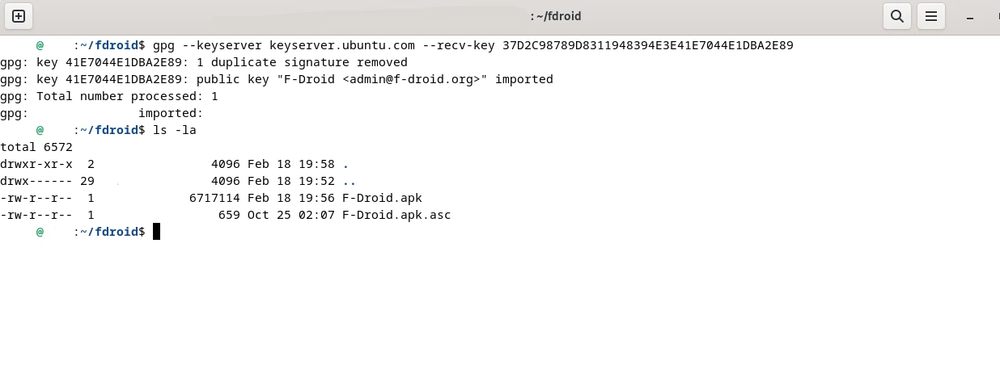
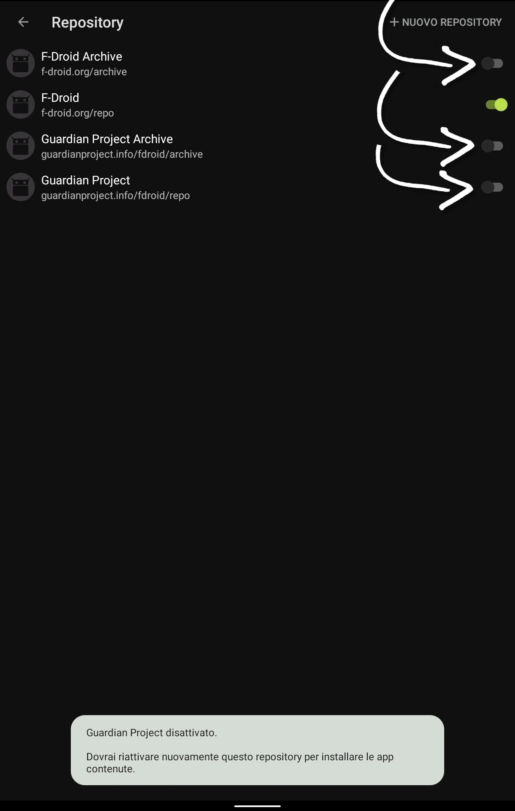

## Cos'è il *sideloading*
Come utenti Bitcoin siamo sempre alla ricerca di soluzioni che siano rispettose della privacy e che soddisfino personali standard di sicurezza. Google Play Store, generalmente, non rispecchia queste esigenze in modo efficace, pertanto la comunità ha trovato (o svilippato) alternative al "monopolio" del Play Store.
Il *sideloading* è proprio questo: la possibilità di scaricare app per Android da fonti diverse dallo store ufficiale di Google.

Uno di questi è F-Droid.

Esaminato in maniera meticolosa nel corso di svariati audit di sicurezza, F-Droid è una piattaforma che applica rigirose policy di esclusione verso app troppo ansiose di tracciare gli utenti.
Non significa che lo scetticismo, sempre salutare quando si ricercano privacy e sicurezza, debba essere messo da parte. Le app tipo i wallet, ad esempio, dovrebbero essere scaricate da sorgenti ufficiali. Ma F-Droid può essere uno dei primi passi di un personale percorso dedicato alla ricerca del miglior grado di privacy possibile.

# Download F-Droid
Si comincia da una veloce ricerca sul web, imparerai col tempo l'url del sito ufficiale a memoria.

Dare una lettura alla documentazione è sempre una buona idea, per poi recarsi nella sezione del *Download*. Quest'ultimo è disponibile subito, tramite QR code per installarlo sul cellulare, ma in questo tutorial vedrai anche l'interessante fase della verifica. Ci apprestiamo, pertanto, a scaricare F-Droid su PC.

È possibile verificare di scaricare una versione legittima, firmata da una chiave PGP unica, ed è proprio quello che vedrai di seguito.

# Download e verifica su OS Linux

Importazione e verifica firme su Linux si eseguono agevolmente da riga di comando.
PApri il terminale -> accertati di essere nella tua */home* -> crea la directory */fdroid* e spostati con il comando *cd* per prepararti al download.

Copia quindi i comandi che si trovano nella pagina di verifica sul sito di F-Droid. Il primo per scaricare il file .asc

il secondo per l'apk.

Infine, il comando per scaricare ed importare la chiave pubblica PGP necessaria alla verifica.

che deve mostrare questo output se avvenuto correttamente.

Con il comando *ls -la* controlla di aver scaricato tutto nella directory corretta.

Ora puoi lanciare il comando di verifica *gpg --verify* selezionando il file .asc

che deve dare questo risultato

---

# Download e verifica su OS Windows
Scarica il file *.apk*, cioè l'applicativo per android ed anche il file *.asc*.
  

per poi ricercare la chiave pubblica PGP e verificare la versione con Kleopatra.
Gli sviluppatori di F-Droid hanno caricato la chiave pubblica su keyserver.ubuntu.com e - nelle istruzioni - c'è la stringa univoca da ricercare.

1. In un'altra finestra del browser, quindi, incolla il link copiato che si trova tra le istruzioni di verifica di F-Droid.

2. Nella schermata che ti si presenta, incolla la chiave pubblica PGP, che inizia per 37D2 e poi clicca su *Search*

3. la ricerca porta ad una pagina con molti link delle chiavi pubbliche, puoi scegliere il primo

4. per decidere di salvare il file proposto.

## Importazione della chiave pubblica

A questo punto vai nella directory dove hai scaricato tutti questi elementi e scegli, con il tasto destro del mouse, di aprire con *Blocco note* il file denominato 37d2xxxx.asc.

Copia tutto il messaggio

Lancia Kleopatra e seleziona il menu *Notepad*

quindi incolla. Alla prima importazione Kleopatra ti chiede la certificazione, che puoi dare.

 

## Verifica della versione di F-Droid

A questo punto torna nel menu principale di Kleopatra, dove compare la chiave pubblica di F-Droid, certificata.
Scegli adesso il menu *Dectryp/Verify* 

che apre il file manager, attraverso il quale selezionerai il file F-Droid.apk **.asc**, per verificarlo.

Kleopatra, o GPG4Win, inizia automaticamente la procedura di verifica. Se l'esito è positivo, appare la conferma come in questa foto

Dopo la verifica delle firme, avrai la ragionevole certezza che nella directory *Download* c'è una versione legittima di F-Droid, firmata cioè con la chiave PGP unica dello sviluppatore. Puoi pertanto trasferire F-Droid sul cellulare ed installarlo.

---

# Installazione sul cellulare

Dopo aver trasferito il file verificato sul cellulare, F-Droid si può installare. Lancia l'installazione cliccando sull'apk dove si trova, ad esempio nel *Download* di Android.

Se si tratta della prima volta che installi sul tuo dispositivo un `apk` da fonte diversa dal Play Store ufficiale, il sistema ti chiede di modificare le impostazioni (di default, ogni dispositivo Android rifiuta questo tipo di installazione, che va autorizzata manualmente).

Automaticamente si arriva nei settings dove si deve autorizzare l'installazione.

Ora puoi  installare F-Droid ed aprirlo.

 

A seconda dello stato di aggiornamento dell'apk installato, F-Droid potrebbe scaricare autonomamente gli aggiornamenti dai Repository.
Se ciò non avviene, procedi comunque in modo manuale. Scegli *Settings* di F-Droid in basso a destra

per vedere lo stato di avanzamento.

Nei *Settings* seleziona *Repository* e 

aggiungi alla app i repository del Guardian Project ed F-Droid Archive.

### L'aggiornamento manuale va fatto di tanto in tanto, seguendo le procedure appena spiegate. Eventuali aggiornamenti venrranno segnalati e saranno visibili cliccando sull'icona delle notifiche.

F-Droid aggiornato è ora disponibile per cercare app da scaricare.

# Conclusioni
Il Guardian Project, respnsabile del progetto, è una comunità di volontari che compilano le app open source per listarle sulla piattaforma.
Può capitare che alcuni aggiornamneti disponibili su Play Store, siano invece in "ritardo" su F-Droid, perché la comunità sta ancora compilando il nuovo sorgente.
**È bene non aggiornare da sorgenti miste le proprie app. Se si sono installate da F-Droid, non aggiornare col Play Store e viceversa**. Se non si è disposti ad aspettare l'aggiornamento del Guardian Project, significa che F-Droid non è lo strumento giusto per noi.

In linea di massima, a parere di chi scrive, i wallet in particolare, non dovrebbero mai essere scaricati da F-Droid (tanto meno dal Play Store), bensì dal sito/repository Github ufficiale dello sviluppatore.
