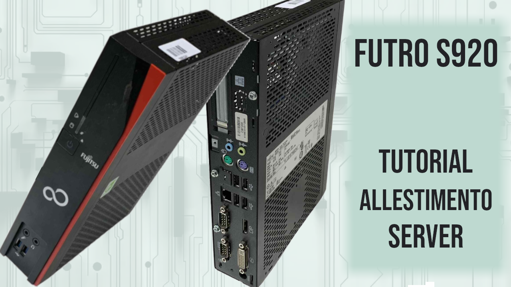

Il Futro che useremo per le lezioni del nodo, è un mini pc molto versatile.

Le istruzioni che seguono, con le relative immagini, sono realizzate per la versione  `FUJITSU Thin Client FUTRO S920`.

**È importante acquistarlo con il suo alimentatore originale**. Cambieremo tutte le parti interne rilevanti (RAM, disco fisso) e aggiungeremo un disco dati SSD da 2 Tera, in quanto il Futro ordinato arriverà con un hard disk da 8 Giga, insufficienti per allestire un nodo Bitcoin.

# Cambiare le parti interne del Futro

Innanzitutto vai a [questo link](https://support.ts.fujitsu.com/IndexDownload.asp?SoftwareGuid=098DA43C-F3AB-4B51-9744-0F4517D0279A) per scaricare il manuale utente originale e fai click su `Direct download` come mostrato in foto.

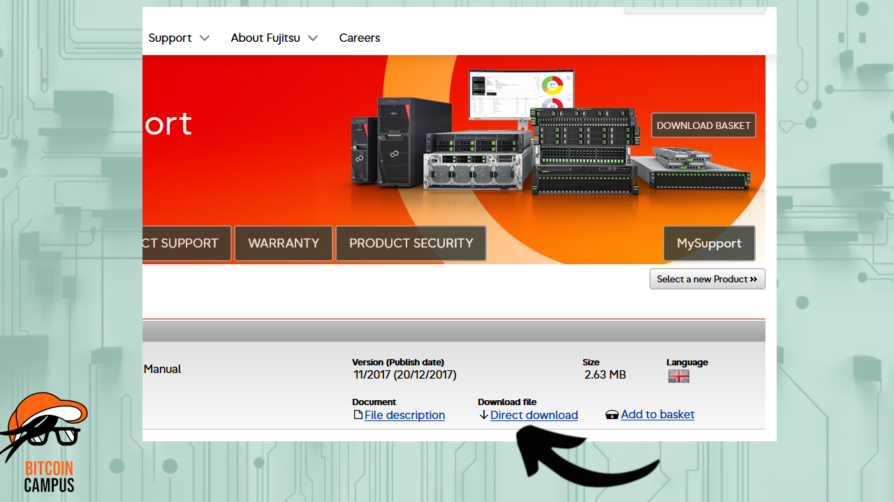

A pagina 34 ci sono le istruzioni per rimuovere lo chassis e aprirlo.

**Prima di fare queste operazioni, assicurati che il Futro sia disconnesso dalla rete di alimentazione e che tutti i cavi di collegamento siano staccati**. Essendo ricondizionato, il Futro potrebbe arrivare con 2 o 3 viti da togliere: **si trovano tutte nella parte posteriore**. Svitale e tienile da parte. Infine rimuovi il coperchio, facendo attenzione perché viene via anche il frontalino.

Il tuo computer si presenterà così:
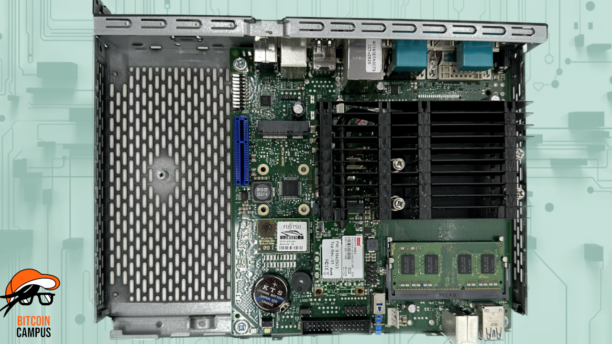

In alcune versioni di S920 ricondizionato si può trovare, a sinistra fissato allo chassis, un piccolo altoparlantino (nella foto sopra non c'è). Lascialo pure attaccato perché non serve rimuoverlo. Deciderai alla fine se vuoi utilizzare quel determinato spazio.

Porta pazienza che tra pochissimo ti sarà tutto più chiaro. Ti suggerisco comunque di leggere il tutorial fino alla fine, per farti un'idea di base e poi di operare; queste operazioni richiederanno tra i 10 e i 25 minuti, a seconda della tua manualità.

# Uno sguardo d'insieme

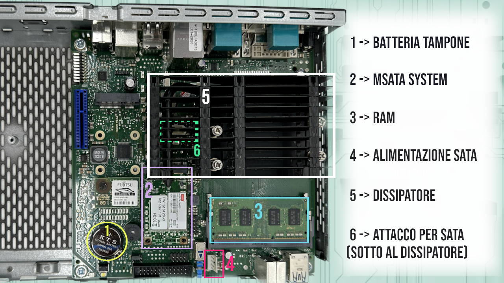

Le parti su cui andremo ad operare sono:
- il disco mSATA - sostituiremo quello in dotazione da 8 GB con uno da almeno 128 GB, che diventerà il disco del sistema operativo;
- la RAM - toglieremo l'unico banco di RAM da 8 GB sostituendolo con 2 diversi banchi, sfruttando entrambi gli slot a disposizione;
- aggiungeremo poi un SSD SATA da 2 TB, dove verrà scaricato Bitcoin Core, la blockchain, l'electrum rust server e l'explorer personale.

# Cosa ci serve

### 1. Naturalmente il Futro

### 2. L'hard Disk da 2 TB, che sia di un SSD di ottima qualità. La spesa vale la pena: se tutto va bene, il server ti potrebbe durare diversi anni
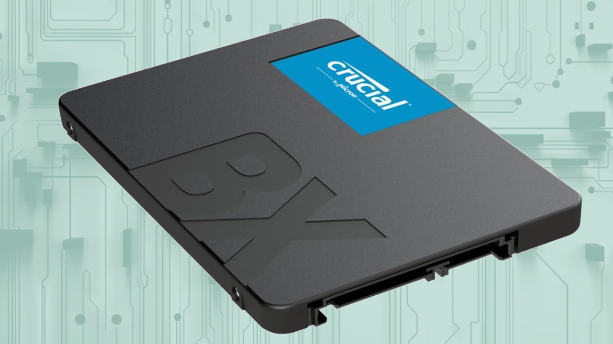

Insieme al Crucial, serviranno anche il suo cavo di alimentazione.
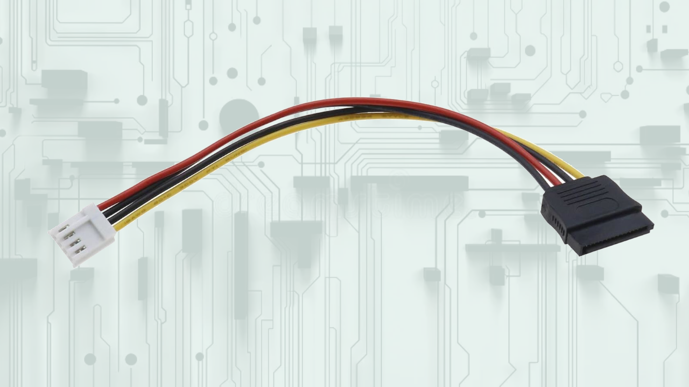

E un cavo SATA, che ad una delle due estremità deve avere un connettore "a pipa", o "low profile" o a "90°"
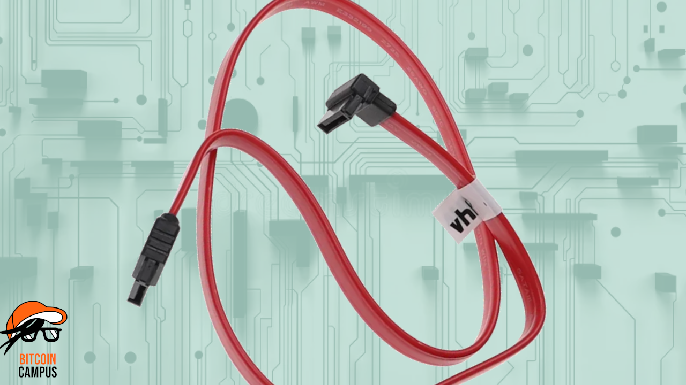

Come vedrai tra poco, l'attacco SATA sulla motherboard si trova sotto al dissipatore: il connettore "low profile" facilita moltissimo le operazioni.
### 3. La nuova RAM, 2 banchi che siano di qualità
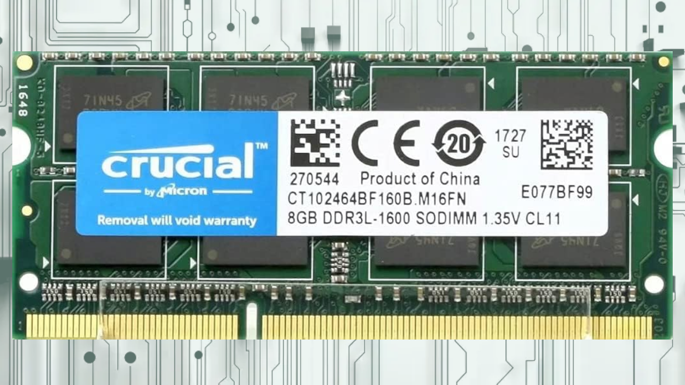

### 3. Un disco di sistema, SSD - mSATA
Sostituiremo il disco installato sul Futro con questo tipo di disco SSD, che deve essere almeno di 128 GB.

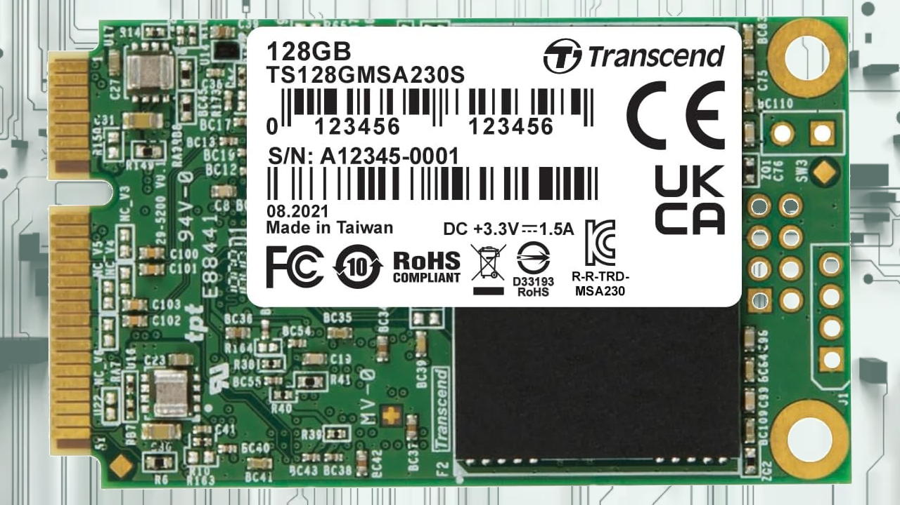

### 5. Un adattatore VGA (femmina) - VDI (femmina) 
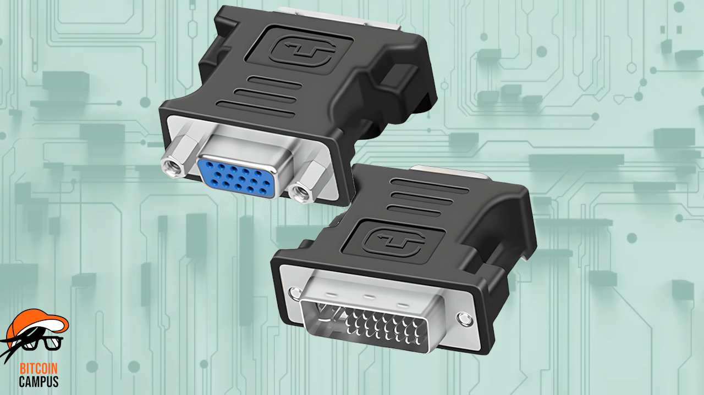

Nel suo pannello posteriore, il Futro presenta due connettori VGA (maschio) che non accettano i classici cavi da monitor VGA, perché la maggior parte ha lo stesso connettore.

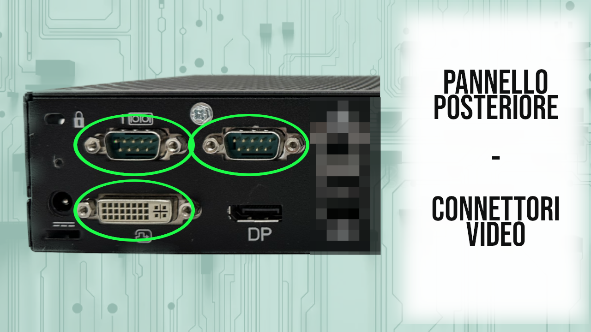

La connessione al monitor serve esclusivamente per la parte di installazione del sistema operativo, poi il Futro verrà prettamente utilizzato in `ssh`, ma è comunque necessaria. **Non rimanere indietro per questo dettaglio**. A casa avevo uno di questi adattatori ed è tornato utile.

#### Procurate tutte queste parti, possiamo iniziare.

# Rimozione del dissipatore
Quando ho allestito il mio Futro, ho trovato comodo rimuovere il dissipatore.

L'attacco SATA per collegare il Crucial da 2TB si trova infatti sotto questo grande elemento nero.
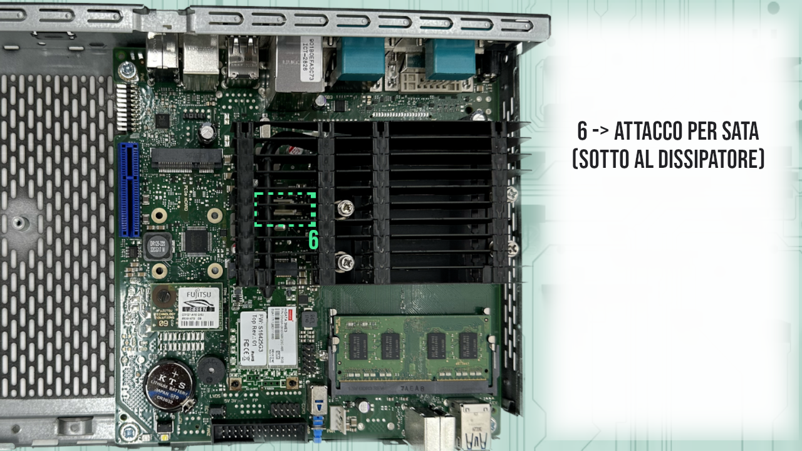

Guardando il tuo Futro e confrontandolo con la prossima foto, vedrai meglio la difficoltà di collegare un cavo SATA e perché si è scelto di suggerirti un cavo con un'estremità "low profile".

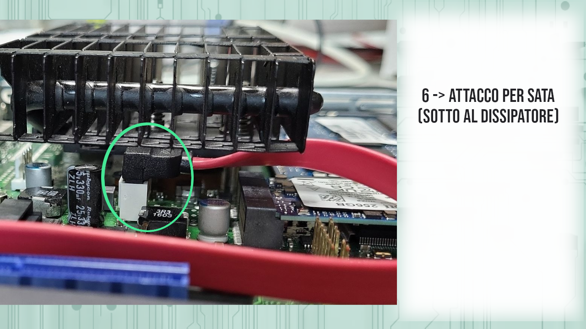

Se pensi di riuscire ad attaccare il cavo SATA senza rimuovere il dissipatore, aiutandoti con delle pinzette, procedi pure. Se invece non ci riesci, dovrai rimuovere il dissipatore, svitando le 4 viti che lo fissano in posizione.

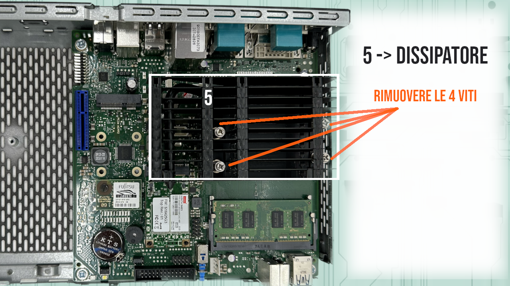

Rimuovere il dissipatore è un'operazione che arriva non priva di imprevisti: questa parte è infatti fissata grazie ad una piastra filettata che si trova nell'intercapedine che c'è tra la scheda madre e lo chassis sottostante. Rimuovendo il dissipatore, la piastra rimane libera e potrebbe spostarsi dalla sede. Ti accorgerai che è successo perché - tentando di rimettere il dissipatore al suo posto - le viti non faranno presa.

Dovrai girare sottosopra il tuo Futro e vedrai la piastra spostata. Con l'aiuto di due pinzette, o piccoli cacciaviti, riportala al suo posto, facendo combaciare i 4 fori della piastra con quelli ricavati sulla scheda madre. Dopodiché rigira velocemente il Futro, ricontrolla che i 4 fori combacino (oppure aggiusta meglio la piastra in posizione). A quel punto potrai riavvitare il dissipatore, facendo attenzione a stringere le 4 viti fino in fondo.

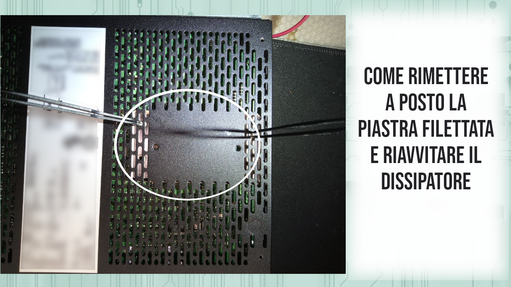

Se opti per questa soluzione, in fondo al tutorial ci sono delle foto migliori che ti aiuteranno a capire che l'operazione è semplice. Te lo anticipo solo per darti un quadro d'insieme fin da subito.

## ⚠️ CPU esposta
Se hai rimosso il dissipatore hai la ⚠️ CPU esposta ⚠️. **Fai atenzione a non rimuovere la pasta termica** in uno slancio di pulizie di primavera.

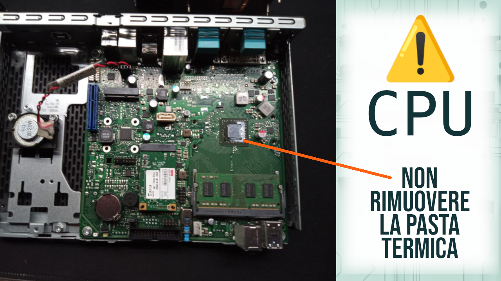

**Però adesso hai anche un bel po' di spazio per lavorare comodamente. Iniziamo!**

# Rimozione della RAM

Andiamo a rimuovere la RAM in dotazione: per farlo è necessario **allargare le due piccole molle metalliche che tengono fissata la schedina -> sollevarla delicatamente nella parte posteriore -> infine estrarla**.

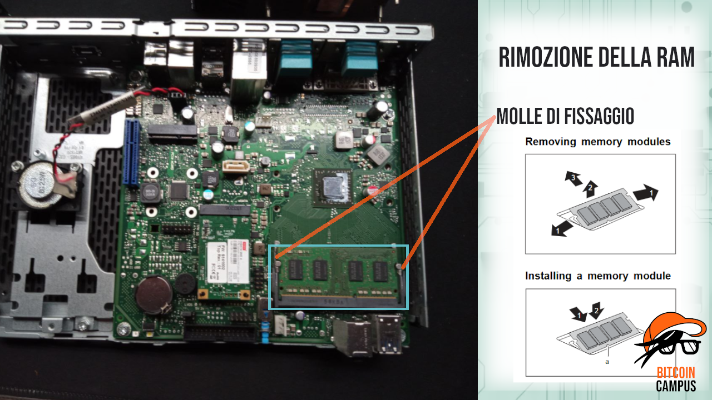

(Aiutati con il manuale utente del Futro a pag. 35)

Per inserire la nuova RAM, utilizza entrambi gli slot a disposizione ed inserisci i banchi acquistati. Per una migliore praticità, inizia ovviamente inserendo la RAM nello slot inferiore e poi passa a quello superiore.

**In ordine inverso rispetto all'estrazione, prima inserisci il banco RAM con il posteriore leggermente sollevato, poi spingi delicatamente il banco nello slot e - contemporaneamente -  abbassa la parte posteriore della scheda, fino a che le mollette metalliche faranno lo scatto del fissaggio**.

# Sostituzione mSATA
Cambiamo ora la memoria di massa. Come detto il Futro è arrivato con un piccolo disco di sistema da 8GB.

Estrailo delicatamente fino a vedere una piccola porzione dei contatti. Noterai a questo punto che l'mSATA è "incastrato" con due piccoli perni di plastica. **Premili contemporaneamente verso l'interno con l'altra mano -> solleva delicatamente l'mSATA -> estrailo**.

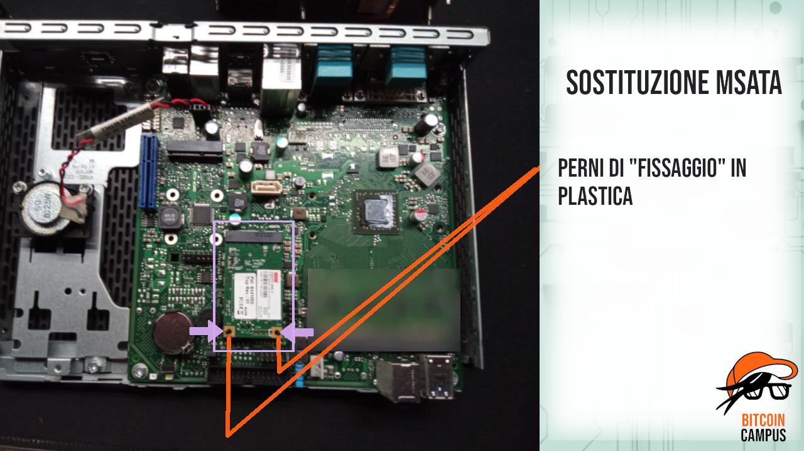

**Ora inserisci il nuovo mSATA: infila la parte dei contatti delicatamente e poi abbassalo fino a farlo incastrare nei perni di plastica**.

# Disco SSD da 2TB
Apri la confezione del Crucial da 2TB, che ospiterà Bitcoin Core, la tua copia della blockchain, l'electrum rust server e il tuo personale mempool explorer. 

Prima di collegare i cavi al Crucial, però, li colleghiamo alla scheda madre. 

Trova il connettore di alimentazione del disco sulla scheda madre. Si trova sul lato esterno della scheda, vicino alla RAM denominato `PWR` e collega qui un lato del cavo di alimentazione.

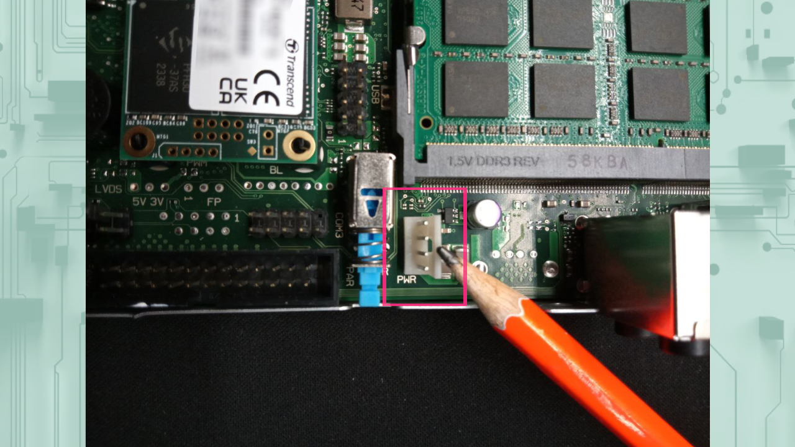

Poi trova il connettore SATA e collega qui il tuo cavo.

⚠️ **N.B.: se il tuo cavo SATA ha un solo lato a 90°, abbi cura di collegare alla scheda madre il "low profile". 

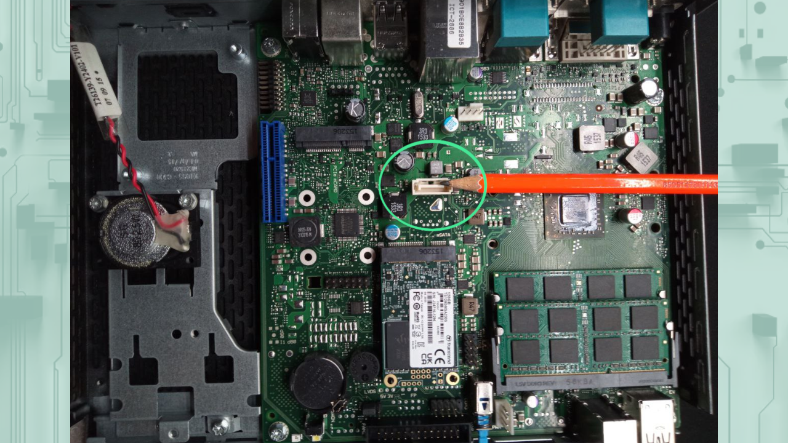

Tutto si mostra come nella prossima foto e possiamo prepararci a rimettere a posto anche il dissipatore.

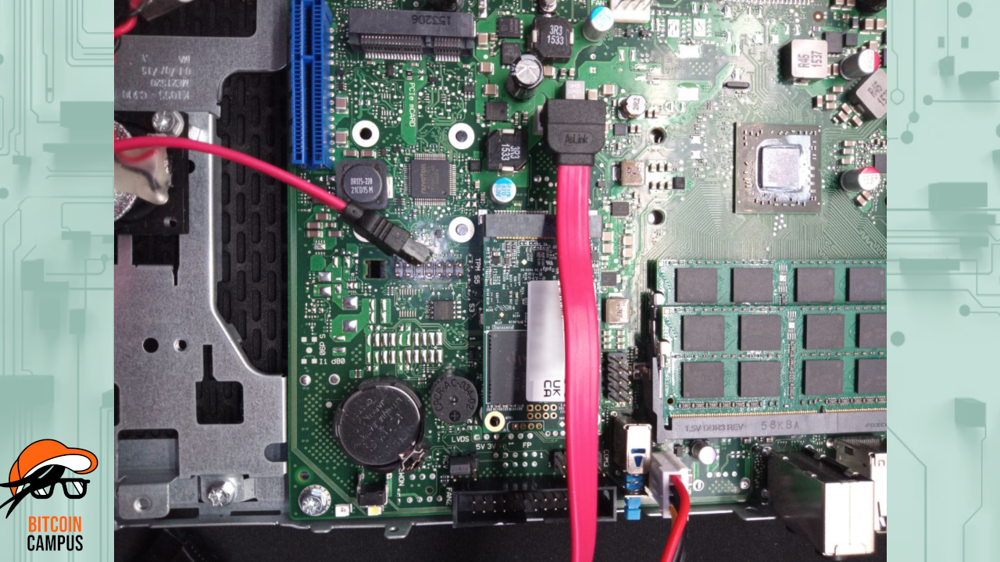

Come abbiamo detto all'inizio, la piastra filettata che permette di avvitare il dissipatore nella sua posizione, potrebbe essersene "andata a spasso". 

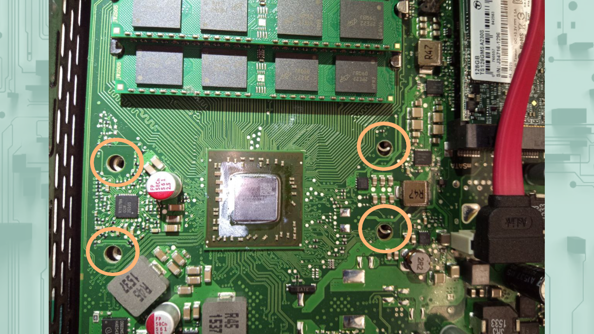

Aiutati con delle pinzette o piccoli cacciaviti per riposizionarla nella sede, facendo coincidere i fori sulla scheda con quelli della piastra.

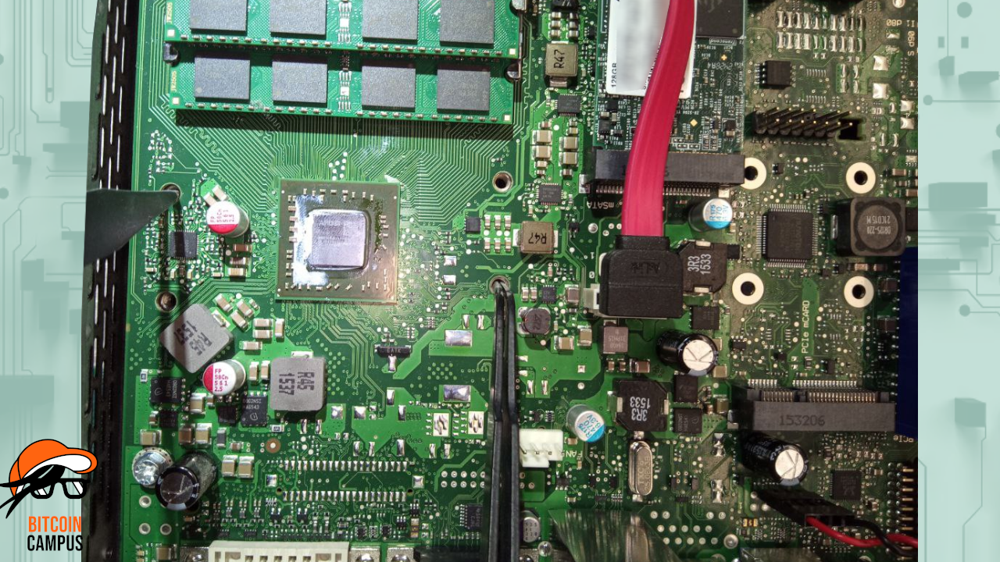

Ora riavvita il disspatore, che deve essere serrato ben stretto, fino a che è possibile.

Abbiamo quasi finito, manca solo il posizionamento del Crucial da 2TB. Puoi usare il metodo che preferisci:
- togliere l'altoparlante e fissarlo in quel vano con delle fascettine da elettricista;
- lasciare l'altoparlantino e fissare il Crucial con un po' di silicone / colla a caldo.

Io ho preferito questa seconda via, mettendo una goccia di colla a caldo sull'involucro esterno di un connettore mini Din, che è quello indicato dalla freccia nella foto seguente.

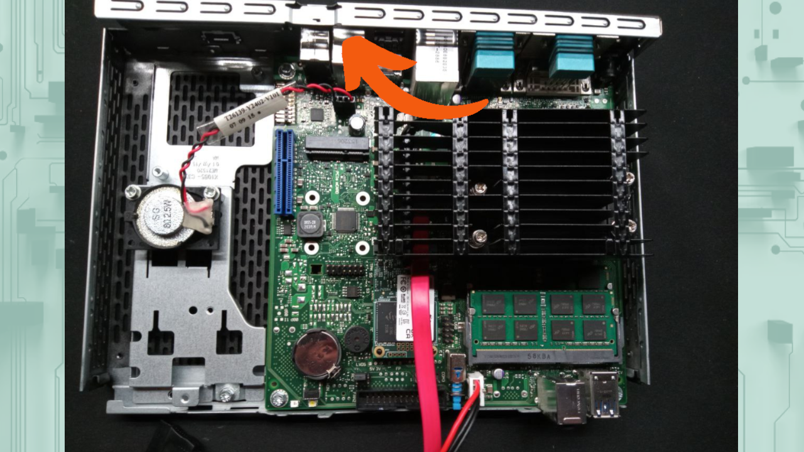

 Ho poi messo una striscia di colla anche sul profilino del Crucial (lato opposto a quello dei connettori) per fissarlo allo chassis del Futro.

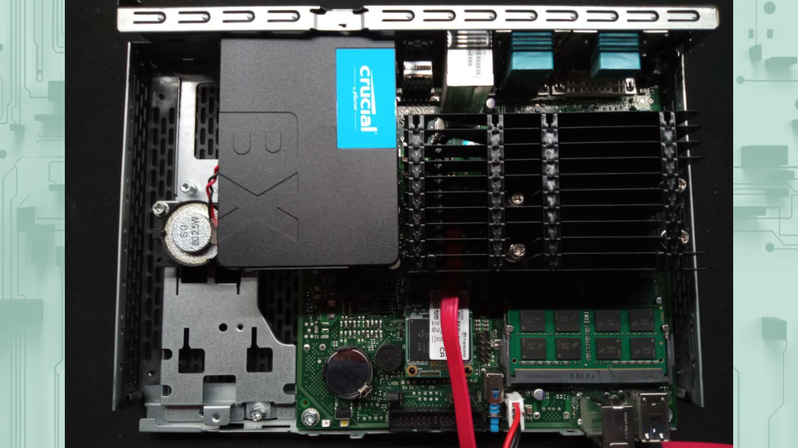

Qualunque sia il metodo da te scelto, ora hai il disco da 2TB fissato nel tuo Futro. Adesso puoi collegare il cavo di alimentazione e il connettore SATA al Crucial.

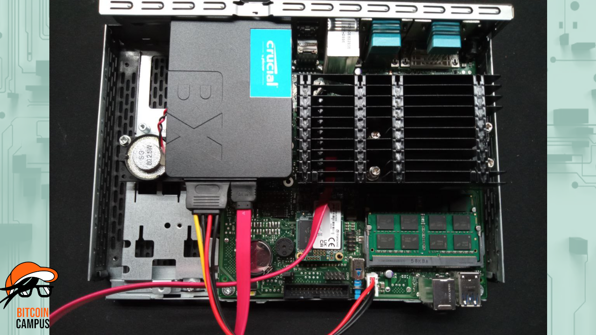

**Complimenti! Hai finito di allestire il Futro S920**.

Rimetti coperchio e frontalino che hai rimosso all'inizio e serra tutto con le sue viti, perché puoi chiuderlo definitivamente.  Abbi cura di adagiare l'eventuale eccedenza dei cavi in modo dolce, senza creare gomiti stretti. 

Hai tantissimo spazio per tenere quest'eccedenza lontano dal dissipatore: usalo.

Ci vediamo a lezione!
