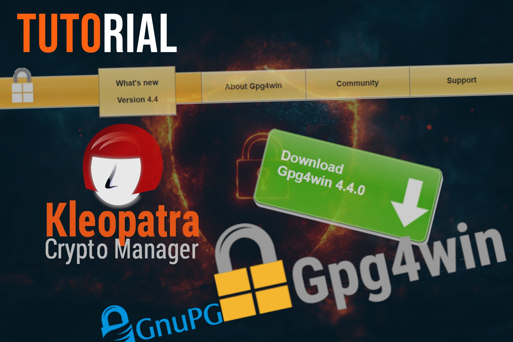

Installare software open source, è di sicuro un'abitudine ben diffusa.
La pratica migliore che possiamo utilizzare, prima di installare sul nostro pc un proramma open source che deve gestire del valore, come Bitcoin, è quella di verificare che sia legittimo.
Non basta accertarsi di averlo scaricato dal sito ufficiale. Dobbiamo anche verificare che sia la versione realmente rilasciata dagli sviluppatori, che lo hanno firmato on la loro chiave GPG.
Per fare questo controllo, abituiamoci a lavorare con:
1. il file eseguibile, o binario. del software;
2. il file .asc, o signature, associato speficamente all'eseguibile;
3. la chiave pubblica dello/degli sviluppatore/i;
4. un programma per decifrare e verificare questi 3 elementi.
È porprio a questo che serve Kleopatra, anche denominato GPG 4 Win.

## Download Kleopatra

In ambiente Linux, la verifica delle firme associate ad un file binario si fa dal terminale.
Kleopatra rende semplice questa operazione per chi usa il sistema operativo Windows.

Si inizia da una ricerca sul web, digitando sul motore di ricerca *gpg4win*

Col tempo imparerete che il sito web da cui scaricare Kleopatra è https://www.gpg4win.org/, che va per l'appunto selezionato tra i risultati di ricerca.

Nella pagina selezionare il bottone verde Download, per iniziare la procedura

In seguito è prevista la schermata che permette di donare via paypal agli sviluppatori di GPG4Win.
Chi vuole può ricompensare gli sviluppatori appunto; si può anche proseguire cliccando sullo "0"

Compare finalmente il tasto blu che consente di scaricare il file.

## Installazione
Dopo aver scaricato Kleopatra, lanciare l'eseguibile per iniziare l'installazione.
Si apre il wizard, con poche righe di presentazione e si può cliccare su *Avanti*

Nella successiva selezione dei componenti da installare, se si è inesperti, lasciare quelli selezionati per default, come in foto sotto, e cliccare poi *Avanti*

 

Lasciare di default anche la directory di sistema che suggerisce i wizard, dopodiché cliccare su *Installa*

L'operazione chiede qualche istante, in cui il wizard mostra alcune delle caratteristiche di GPG 4 Win e, soprattutto, l'avanzamento

Terminata l'installazione, se tutto è stato eseguito correttamente, cliccare su *Avanti*

Per iniziare ad utilizzare Kleopatra è necessario riavviare il computer.

## Primo avvio di Kleopatra
L'installazione ha creato un'icona di collegamento sul desktop: Kleopatra si può lanciare dal collegamento.
Al primo avvio, il programma chiederà di creare o importare una coppia di chiavi: sono le chiavi GPG, privata e pubblica, che appartengono all'utente che sta usando GPG4Win.
Se si possiede già una coppia di chiavi, si può selezionare *Importa*, altrimenti cliccare su *Nuova coppia di chiavi*

Per creare il profilo è necessario mettere un nome utente. Se Kleopatra verrà utilizzata solo per verificare i software, non è obbligatorio inserire un indirizzo email in questa fase.

Quando la coppia di chiavi è stata generata, compare il relativo certificato e si può terminare cliccando *OK*.

## Scelta della lingua
Kleopatra è pronto per essere utilizzato. Compaiono i menu e le funzionalità sono tutte attive.

Dal menu **strumenti** consiglio di cambiare la lingua utilizzata, da italiano a inglese (American English). Le traduzioni potrebbero non essere corrette ma, soprattutto, tutorial e suggerimenti su come utilizzare GPG4Win si troveranno più facilmente in inglese e sarà più semplice per ogni utente orientarsi se il programma è impostato proprio in quella lingua.
Già che ci siamo, togliamo con *Rimuovi* anche tutte le altre lingue di ripiego.

Sarà necessario riavviare il PC per rendere effettivi tutti i cambiamenti effettuati nelle impostazioni di Kleopatra, che si presenterà poi in inglese

## Raccomandazioni sul futuro utilizzo di Kleopatra
Come accennato in precedenza, Kleopatra è l'elemento chiave per verificare di aver scaricato un software legittimo.
Quest procedura, a volte chiamata *verifica delle firme* per accorciare, si può adesso eseguire agilmente con GPG4Win.

Per farlo è necessario ricordarsi di importare la chiave pubblica dello sviluppatore di quel determinato software e nei vari tutorial a seguire viene specificato dove trovarla e come importarla.
L'importazione della chiave pubblica verrà poi mostrata nella schermata iniziale, *Cerificates*.

Ogni chiave pubblica ha una data di emissione, *Valid From* ed una di scadenza, *Valid Until*. Rinnvare la nuova chiave pubblica è compito dello sviluppatore.
Nell'eventualità che sia scaduta, Kleopatra mostra il relativo certificato in colore rosso.
L'utente dovrà tornare all'URL dove si trova la chiave pubblica rinnovata e ripetere le procedura di importazione.

In fase di verifica dell'eseguibile, invece, è **molto importante scaricare il file delle signatures e il .exe (o .msi) nella stessa directory**, altrimenti Kleopatra non sarà in grado di fornire un risultato.
