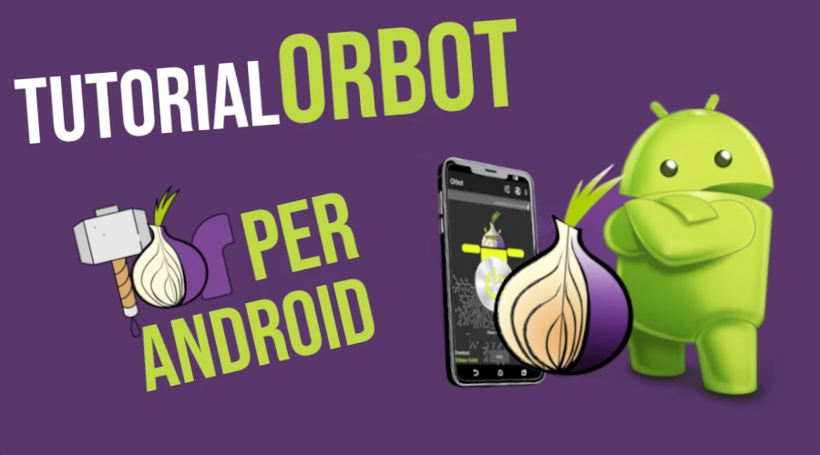

# Introduzione

Orbot è un'app per Android che utilizza la rete Tor (The Onion Routing) per nascondere il vostro traffico internet, difendendo voi e la vostra privacy dalle analisi del traffico, che potrebbero pregiudicare la libertà e - a volte - le relazioni commerciali e le attività.
Diversamente dalle VPN e dai proxy tradizionali, che instradano direttamente il traffico internet, Orbot cripta i dati e li fa rimbalzare attraverso diversi nodi sparsi in tutto il mondo.
Sebbene questo processo possa fare risultare più lento il traffico dati, la privacy e la riservatezza ottenuti sono incredibilmente affidabili.

## Orbot per Android

Sfruttando la rete Tor, Orbot permette quindi di instradare il traffico di qualsiasi app, garantendo alti standard di sicurezza.
Qualsiasi app del telefono può, infatti, essere convogliata su Orbot e ostrare solo che i dati stanno viaggiando sulla rete Tor.

## Download di Orbot

Orbot è un progetto FOSS del Guardian Project e può essere scaricato direttamente in formato APK senza passare dagli store ufficiali.
Dopo aver scaricato e installato F-Droid sul proprio dispositivo, è preferibile usare questo store di sideloading per arrivare a Orbot, continuando così un percorso di privacy personale.
Lanciare F-Droid e, dalla home, aprire la casella di ricerca

Cercare Orbot e scegliere _Orbot: Proxy with Tor_ con l'icona mostrata in foto sotto:

Una volta trovato il file .apk di riferimento, scegliere _INSTALL_

## Connettersi alla rete Tor

Orbot si apre ed è pronto a connettersi alla rete Tor, basta selezionare _START VPN_

La connessione tramite rete Tor è lenta per design, quindi occorre attendere con pazienza

Una volta connesso, Orbot si presenta così:

Un'occhiata ai menu della pagina principale è d'obbligo.

- _Choose apps_ è il menu attraverso il quale si selezionano le varie app il cui traffico è da instradare sulla rete Tor. In generale meglio non instradare le app delle banche, così come i social tradizionali: è una scelta completamente senza senso. In un'ottica di privacy orientata all'utilizzo dei wallet Bitcoin, meglio selezionare i vari wallet che si utilizzano per i propri pagamenti e/o transazioni.
Una volta aperto questo menu, viene mostrata la lista completa delle app in ordine alfabetico. Scegliere i wallet e poi salvare.
- _Change exit_ comporta la scelta del nosdo di uscita dalla rete Onion: Germania e Romania sono, allo stato attuale, una buona opzione da seguire, per scegliere i server più veloci.
- _Refresh_ permette di cambiare circuito su cui si è instradati, per aumentare le prestazioni (ad esempio dopo qualche momento di inattività personale).
- _Turn Tor off_ spegne l'instradamento attraverso la rete Tor e si torna a navigare nel modo tradizionale.

