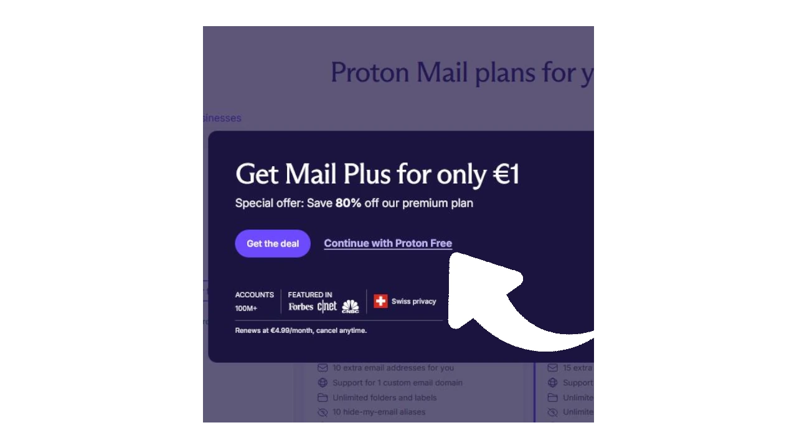
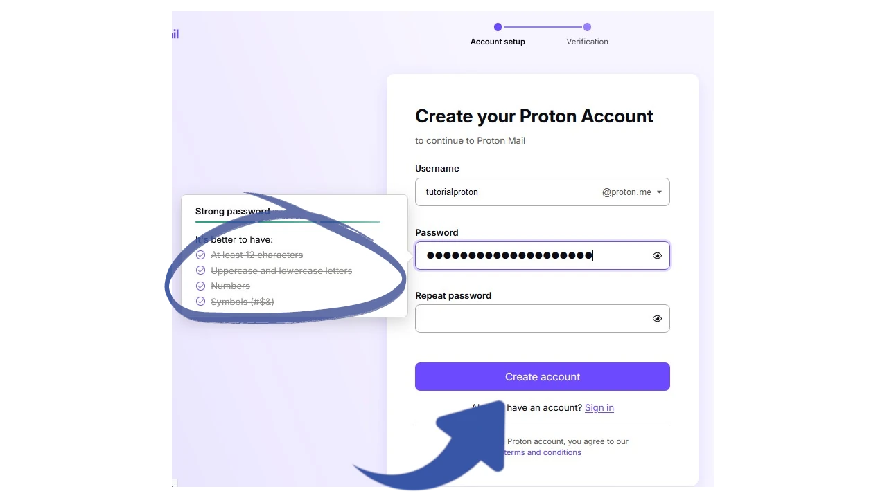
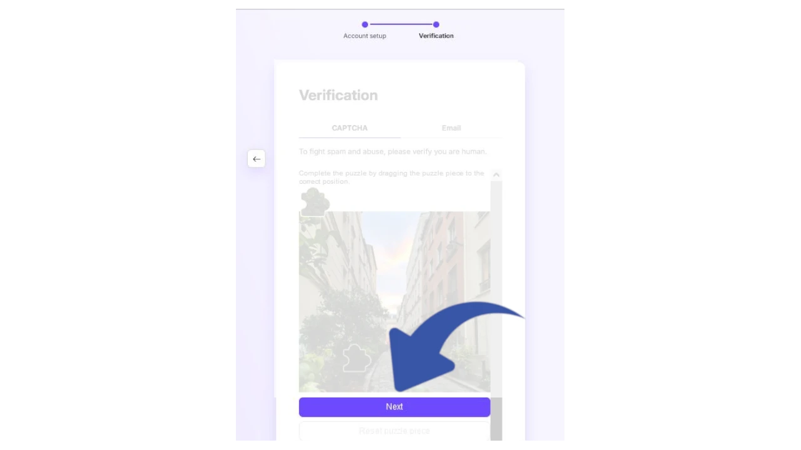
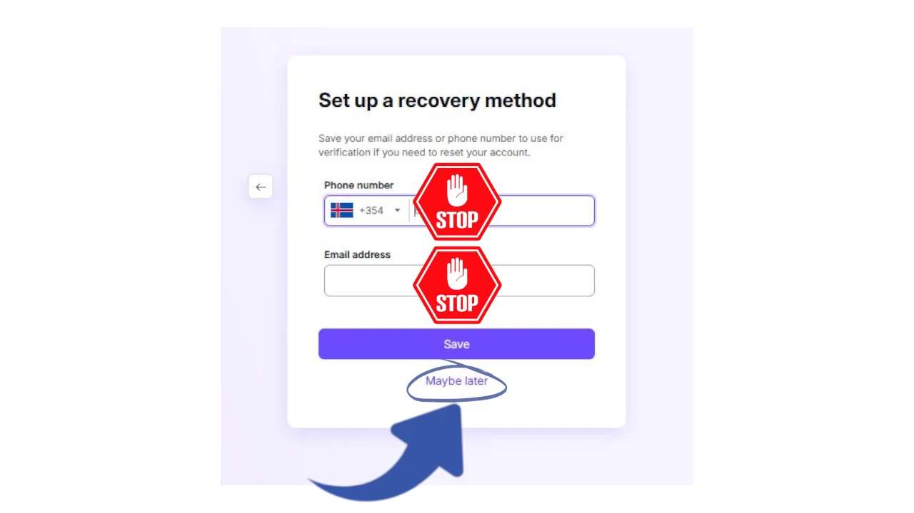
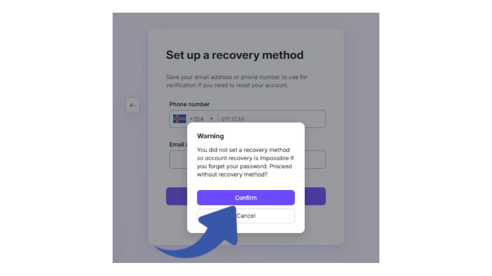
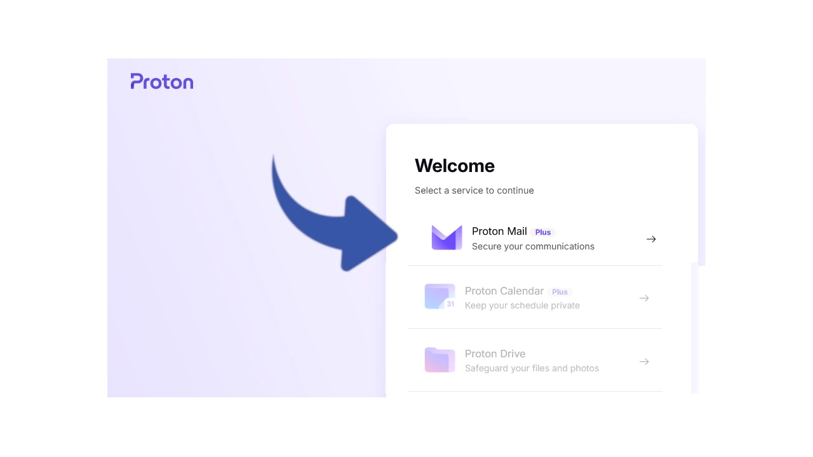
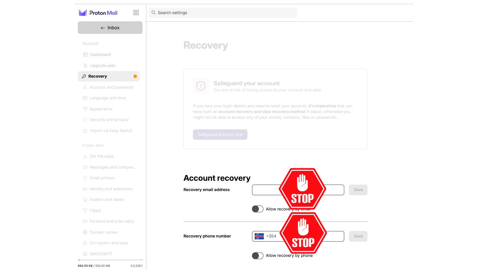
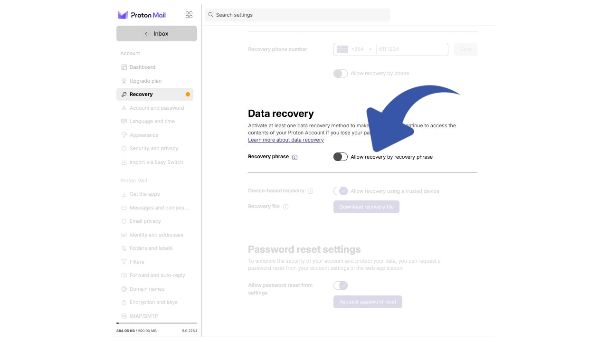
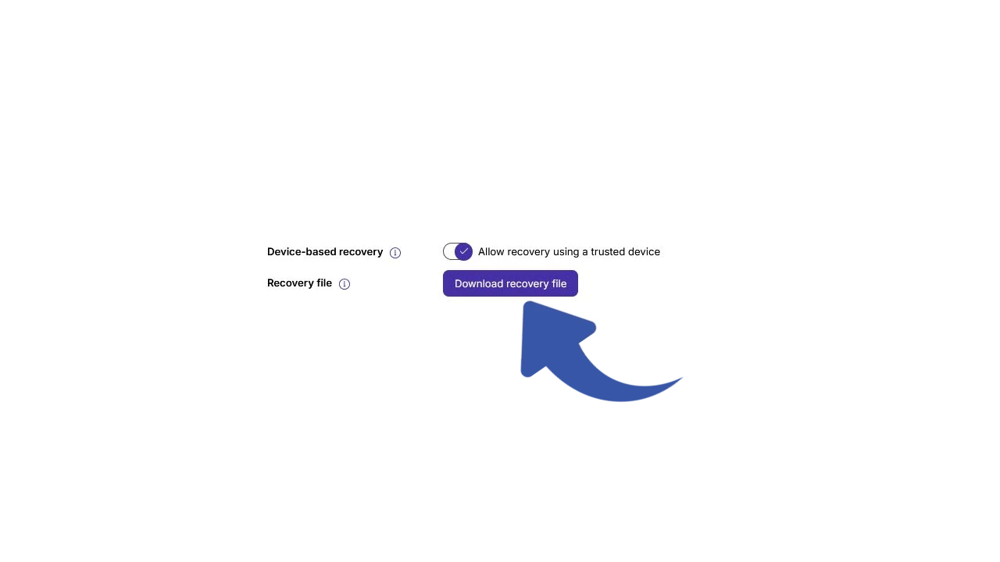
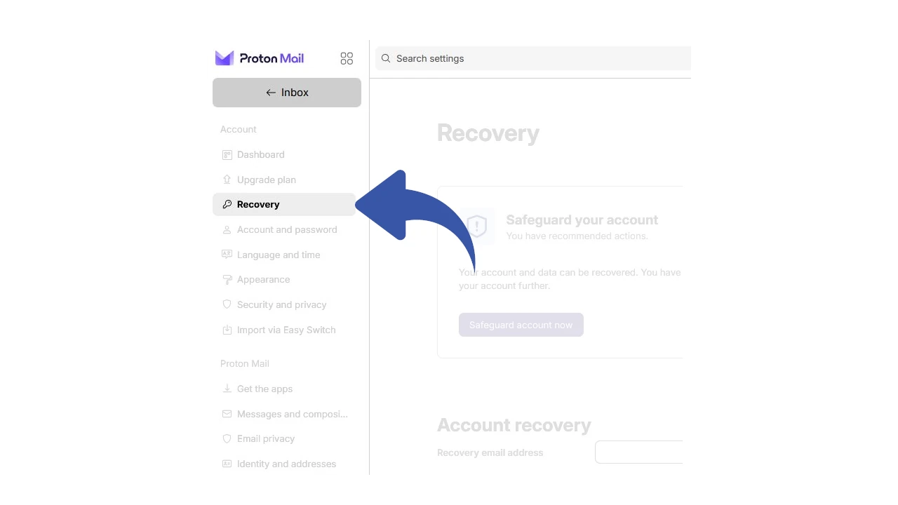

## Introduzione
Se ancora non conosci **Proton Mail**, questa breve presentazione e il tutorial che segue fa al caso tuo.
Molto in breve, Proton è un provider di posta elettronica che lavora principalmente da interfaccia web. È popolare tra tutti coloro che desiderano privacy nelle comunicazioni email.

Lo scopo del tutorial non è presentare tutte le caratteristiche di Proton Mail, ma devi sapere che:
- i server di Proton Mail sono tutti in Svizzera, che ha una giurisdizione molto più orientata alla privacy rispetto all'UE;
- l'indirizzo IP viene rimosso dai metadati dell'email;
- Proton Mail supporta OpenPGP e il servizio è E2EE. **L'unica parte del messaggio che non è criptato è l'oggetto della mail**;
- puoi importare tutti i contatti da un altro provider come Gmail, Outlook ecc;
- se perdi le credenziali di accesso al tuoi account, Proton AG non può darti il supporto necessario al ripristino. Quindi è indispensabile un metodo di recupero.

Il metodo di recupero base, prevede di fornire un numero di telefono o un altro indirizzo email (**non Proton**) che devono essere attivi per poter ricevere sia i messaggi di autenticazione iniziali, sia le istruzione di recupero in caso di bisogno.

In questo tutorial ti mostrerò come evitare di dare queste informazioni, utilizzando un altro metodo di recovery.

## Creazione dell'account

Dal browser desktop, vai sul sito web proton.me e scegli _Create a free account_.

Nella schermata successiva atterrerai sulla pagina _Pricing_, in cui puoi scegliere _Get Proton for free_.

Nel passaggio successivo, intermedio, Proton AG proverà comunque a proporti un'offerta esclusiva per ottenere un piano a pagamento ad un prezzo stracciato. Ti consiglio di segliere _Continue with Proton Free_, almeno per provare il servizio. Potrai decidere in seguito di fare l'upgrade di un indirizzo email in uso.

Scegli un nome utente, una password facendo attenzione a inserire tutti i caratteri richiesti, dopodiché scegli _Create account_.

- Devi superare un captcha

- scegliere un nome da visualizzare come mittente

- **ed è a questo punto che Proton richiede le informazioni personali per impostare un metodo di ripristino**. Io ti consiglio di cliccare _Maybe later_.

- La procedura avvisa che - in caso di smarrimento della password - non potrai recuperare in alcun modo l'account senza impostare uno dei metodi suggeriti in precedenza. Procedi pure selezionando _Confirm_.

L'account email è ora creato. Devi solo compiere i passi di un breve percorso di presentazione

- scegliere un tema

- e finalmente Proton da il benvenuto nella schermata dove puoi accedere ai servizi.
Scopri così che hai a disposizione una vasta gamma di servizi:
- mail
- calendario
- cloud drive
- vpn
- password manager
- ~~e un wallet~~
##### Avvalersi di un unico provider per tutte queste cose, non è una pratica che mi faccia impazzire. Puoi provare tutto ciò che ti può essere utile: questi servizi di Proton sono veramente efficienti.
##### L'unico che non ho mai provato è il wallet. E non lo farò mai.

Per continare con la posta elettronica, scegli _Proton Mail_.

## Impostazione di un metodo di recupero

Sei finalmente nella dashboard web della tua nuova casella di posta elettronica.
Hai già il messaggio di benvenuto, il menu principale nella barra a sinistra e - sulla destra - una notifica che ti segnala 2 "alert": il _Security center_. Clicca lì per aprire il menu.

Fai scroll verso il basso, per trovare l'origine delle notifiche: _Account recovery_ e _Data recovery_.

In _Account recovery_, Proton ti suggerisce di usare i metodi di ripristino che hai saltato in fase di creazione dell'account.

Scorrendo verso il basso trovi _Data recovery_, dove ti viene proposto di ripristinare l'account tramite una recovery phrase. Scegli di abilitare _Allow recovery by recovery phrase_

Ti verrà mostrata una frase di 12 parole, che puoi sia copiare e incollare suun file protetto, sia scaricare da download diretto, magari su un backup criptato.

Proseguendo, hai la possibilità di continuare, impostando un metodo di recupero basato su un device fidato. Questo metodo prevede di scaricare un file `.asc` e ti consiglio di farlo, per avere una seconda modalità di ripristino.
Abilita _Allow recovery using a trusted device_

Una volta scaricato il file `.asc` la schermata cambia.

Dopo aver impostato questi due metodi, se per caso perdi l'accesso ai due backup appena creati, ma puoi ancora utilizzare Proton Mail con le credenziali, ti consiglio di rigenerare una nuova recovery phrase e un nuovo recovery file.

Ma intanto, i due alert di notifica sono scomparsi perché hai impostato 2 metodi di recupero, senza però cedere informazioni riservate come il numero di cellulare o un indirizzo email magari legato alla tua identità reale.

Prima di iniziare ad utilizzare il tuo nuovo account Proton, vai nel menu _Security and privacy_

e disabilita la raccolta di dati, anche se per uso diagnostico legato alla app e suoi eventuali crash nel funzionamento, mentre puoi lasciare attivati gli altri servizi che Proton attiva di default.

