## Login = email = perdita di privacy

Nel mondo digitale è prassi ormai consolidata avere un account per ogni piattaforma cui si desidera accedere.
Ognuno di di questi servizi prevede un accesso, normalmente associato all'accoppiata _username/password_. Spesso, lo username è l'email personale dell'utente.

Usando l'indirizzo email personale per ogni login, è facile immaginare il primo traguardo: perdita di riservatezza, che diventa assoluta se l'indirizzo è costitutio da _nome.cognome@servizioemail.com_.

Sviluppatori open source hanno creato una serie di suite applicative, nate proprio per far ritrovare agli utenti un po' di privacy: login sì, ma con alias al posto dell'email che rivela l'identità privata.

Il più semplice, tra quelli che ho provato personalmente e che sto ancora testando, è proprio [Simple Login](https://simplelogin.io/).

## Alias

Un'email alias non fa altro che sostituire _nome.cognome_ del proprio indirizzo di posta elettronica con un nome fittizio. Nulla cambia per l'utente, in quanto il servizio di alias inoltrerà le email da e per l'indirizzo usato normalmente. Ognuno continuerà ad utilizzare la propria casella email come al solito, ma dall'altra parte - invece di rivelare nome e cognome - risulterà un utente non riconoscibile.
Tale servizio deve essere efficiente e Simple Login, fino ad ora, lo è.

Andando sul sito di Simple Login, la prima volta si deve creare un account (anche qui!), usando l'indirizzo email "ufficiale". Qui si dovrà inserire la posta elettronica, una password e risolvere un captcha.

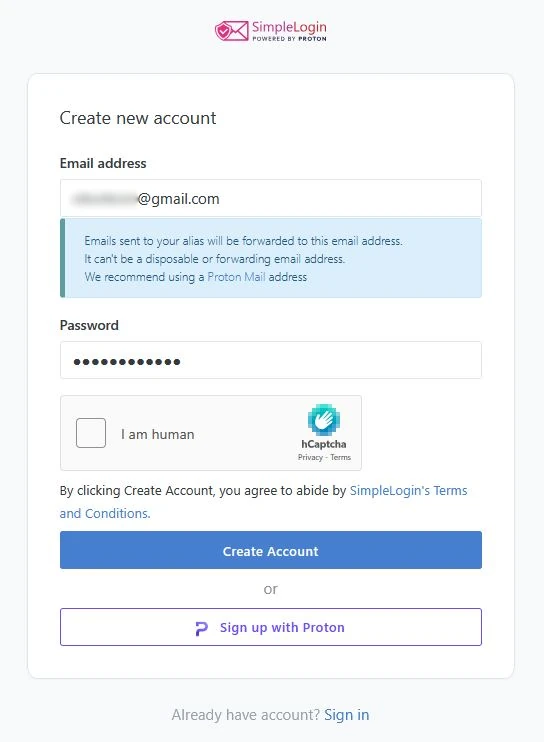

Simple Login manda un messaggio per la verifica all'indirizzo di posta elettronica indicato. Anziché cliccare il pulsante di verifica, è bene copiare il link e incollarlo sulla barra degli indirizzi

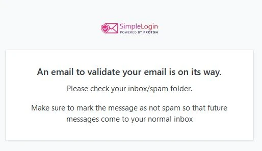

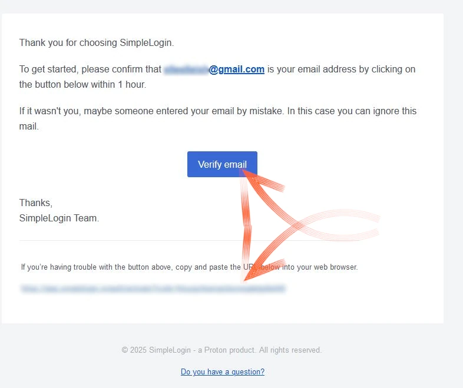

Si apre subito la dashboard di Simple Login, con un breve tutorial per la navigazione.

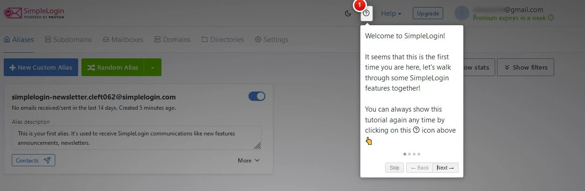

Si può notare che Simple Login ha attivato automaticamente l'iscrizione alla newsletter, che si può disattivare dall'apposito comando

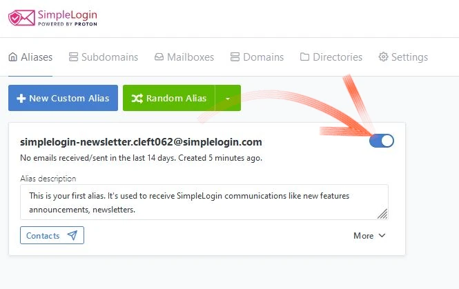

## Impostazioni

Subito possiamo dare un'occhiata ai _Settings_ per scoprire le caratteristiche del servizio.
Simple Login si apre con tutte le features attive, anche quelle _Premium_ che restano attive per 10 giorni.
Si scopre che, terminato il periodo di prova si avrà la possibilità di creare 10 alias con questo profilo e che si può collegare la propria email di Proton direttamente, in quando Simple Login è stata assorbita dall'email provider svizzero

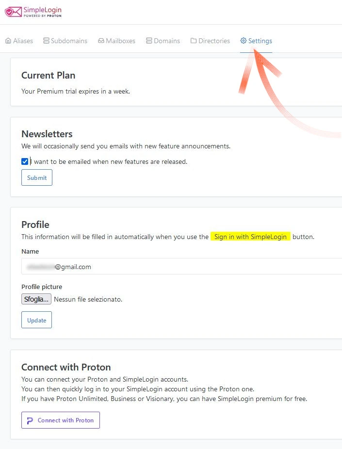

si possono impostare una serie di parametri, o fare un controllo se la propria casella di posta elettronica ha subito dei leak di privacy

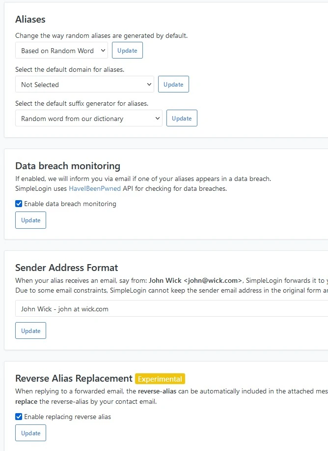

Infine, si può esportare un back up del profilo, o importarne uno da un altro provider.

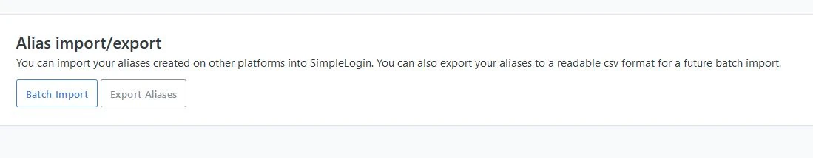

### Email di lavoro

Per chi usa email con un dominio personale, intese come email di lavoro, può impostare questo dominio privato.

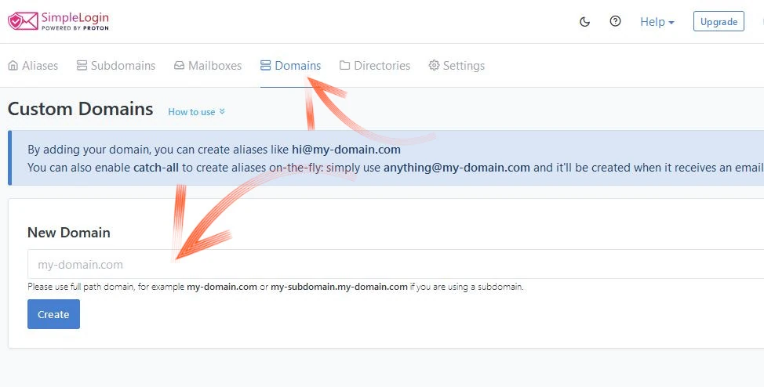

Dal pannello principale, scegliendo _Mailboxes_, è addirittura possibile aggiungere altri indirizzi di posta elettronica e, anche con questi, utilizzare gli alias che si andranno a creare.
In questo tutorial ho deciso ad esempio di creare il profilo con una casella di _gmail.com_, per poi associare un indirizzo di _proton.me_.

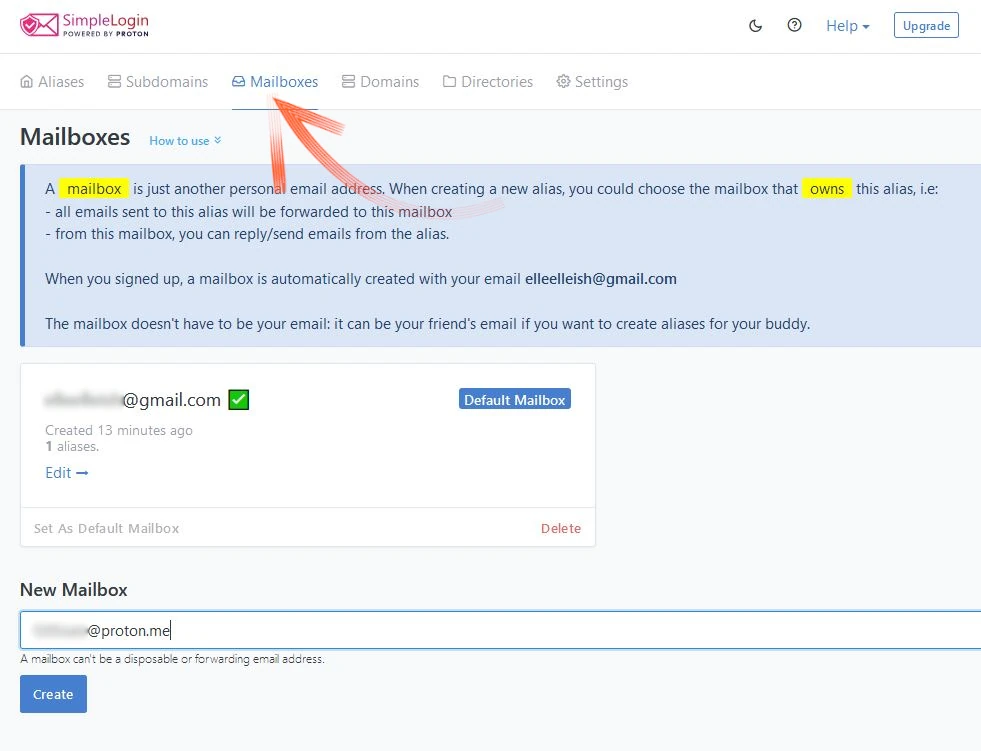

Aggiungendo un nuovo indirizzo, soprattutto se appartiene al provider Proton, accende la possibilità di entrare in modalità _sudo_, super user. Simple Login chiederà di immettere la password di questa casella, per provare di esserne i legittimi proprietari.

⚠️ **Personalmente sconsiglio di farlo**. ⚠️

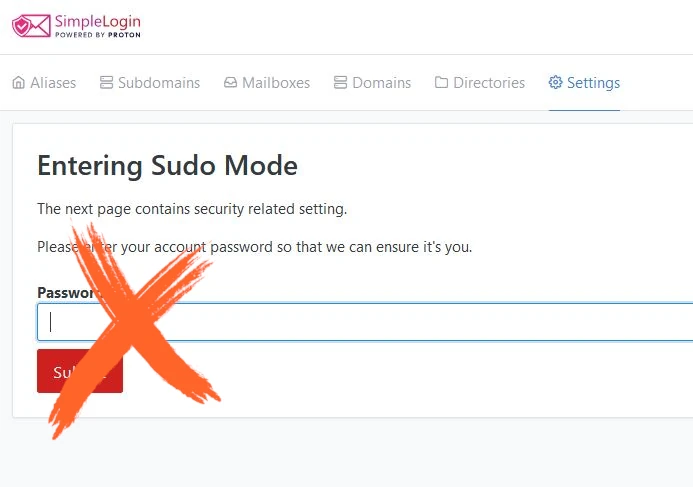

##### Meglio accedere alla casella email  -> copiare il link per la verifica e incollarlo nella barra degli URL -> e ottenere la verifica senza rivelare la password.

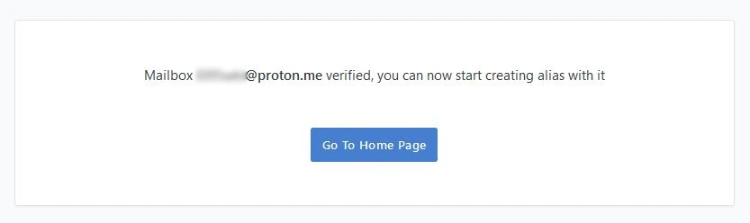

Dei due indirizzi inseriti, uno diventa quello di default e l'altro vedremo più avanti nel tutorial come si può eventualmente selezionare. L'impostazione è facilmente individuabile nella dashboard.

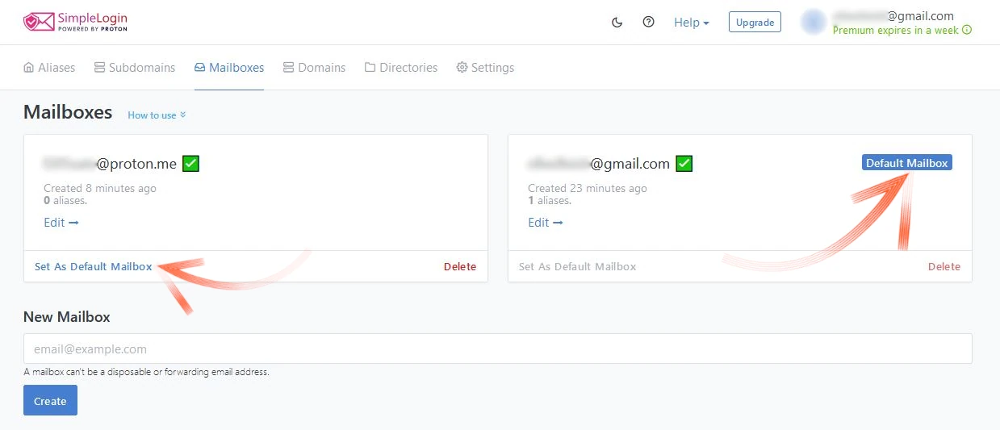

Dopo aver aggiunto un secondo indirizzo di posta (opzionale), vediamo cosa possiamo fare con Simple Login.

## Creazione degli alias

Nel pannello, il primo menu a disposizione è proprio denominato _Alias_, ed è qui che si creano.
Si possono creare in modo casuale, scegliendo _Random Alias_, il pulsante verde che si vede nella prossima foto. Questo crea un indirizzo di posta molto suggestivo.

Se, invece, si vuole dare un nome per riconoscere e differenziare i servizi, si deve scegliere _New Custom Alias_. Così facendo, si può dare all'alias il nome del servizio a cui si vuole accedere (social media, provider di servizi, webinar, sconosciuti incontrati per caso ecc.). Il resto lo fa Simple Login.

Per gioco (ma non tanto) ho deciso di creare un alias per la banca e l'ho chiamato `BANK`. Anche se è vero che la mia banca sa tutto di me, mi risulta divertente comunicare con loro con un indirizzo di posta elettronica a loro incomprensibile.
Simple Login genera infatti un nome random, che viene separato da quello scelto da noi con un `.`

Ecco che il nuovo indirizzo di posta elettronica può diventare:
- bank.breeding123@aleeas.com
- bank.platter456@slmails.com
- bank.preoccupy789@8shield.net
- e così via

Si può scegliere più di un dominio: quelli pubblici sono a disposizione per il piano free, mentre altri, indicati come privati (tra cui _@simplelogin.com_), ampliano la scelta per gli utenti che decidono di sottoscrivere un piano a pagamento.

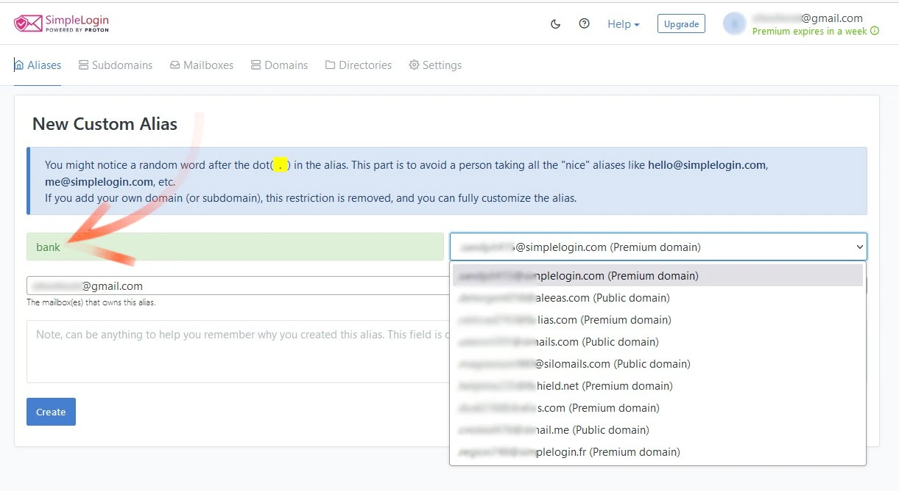

Una volta scelto il suffisso random e il dominio, si può impostare se questo nuovo (e bizzarro) indirizzo deve fungere da alias per una sola delle caselle email personali, oppure per tutte.
L'alias è pronto ed attivo scegliendo _Create_

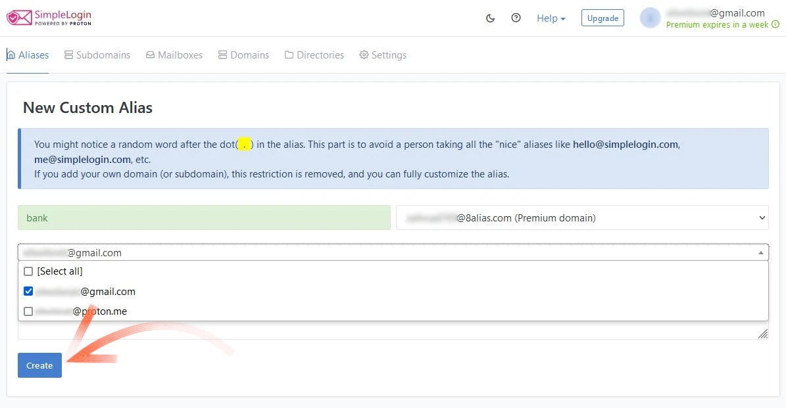

Il nuovo indirizzo di posta è creato ed è visibile, pronto per essere mandato (alla banca!) semplicemente copiandolo.

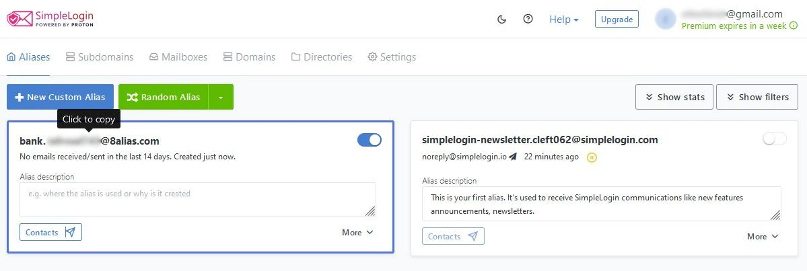

A questo punto ci si può concentrare sulla creazione di un alias per ogni servizio o piattaforma cui si vuole fare accesso e dove l'email è richiesta, come parametro indispensabile per la creazione di un account.

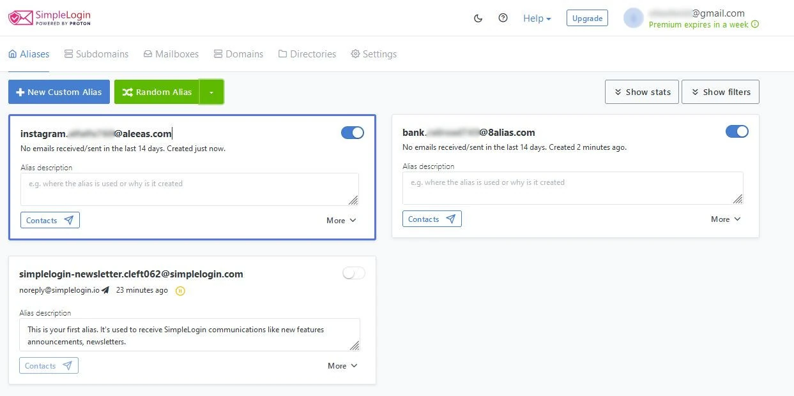

Per i fanatici della privacy, è possibile anche creare un indirizzo di posta basato non su un nome leggibile, ma sul protocollo UUID, che crea un identificativo unico di 128 bit e la cui creazione non è controllata da parti centralizzate. Questa opzione, comoda per alcuni account delicati, è disponibile nel Menu _Random Alias_.

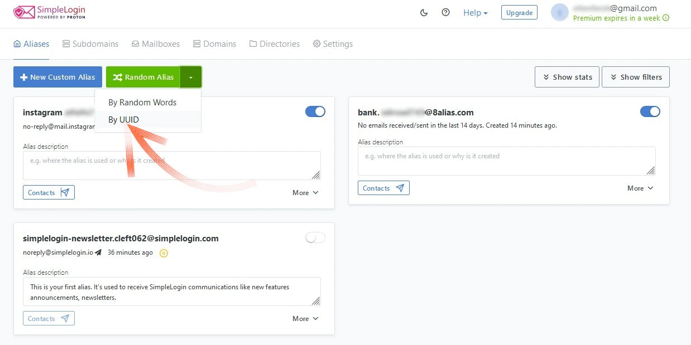
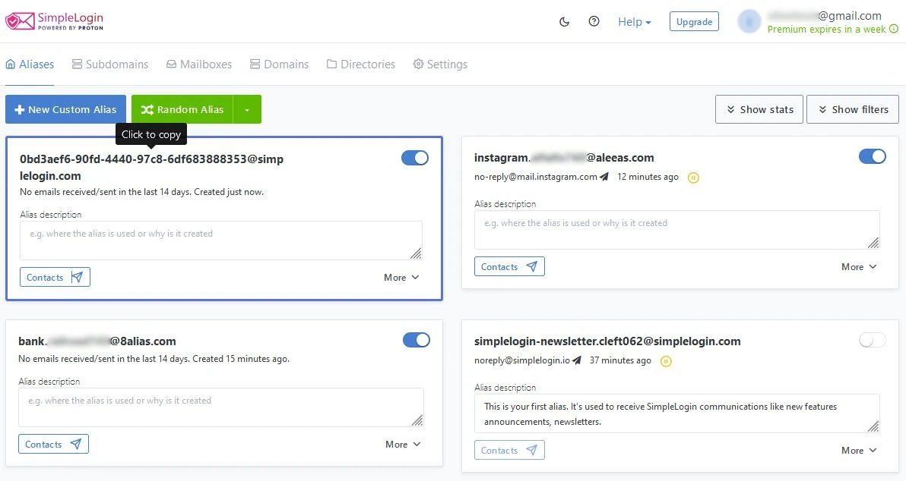

Come si può notare, è un indirizzo email che si deve saper poi gestire.
Se si cambia idea e non si vuole più utilizzare un alias, basta cliccare sul comando _More_ di ogni singolo alias e scegliere _Delete_.

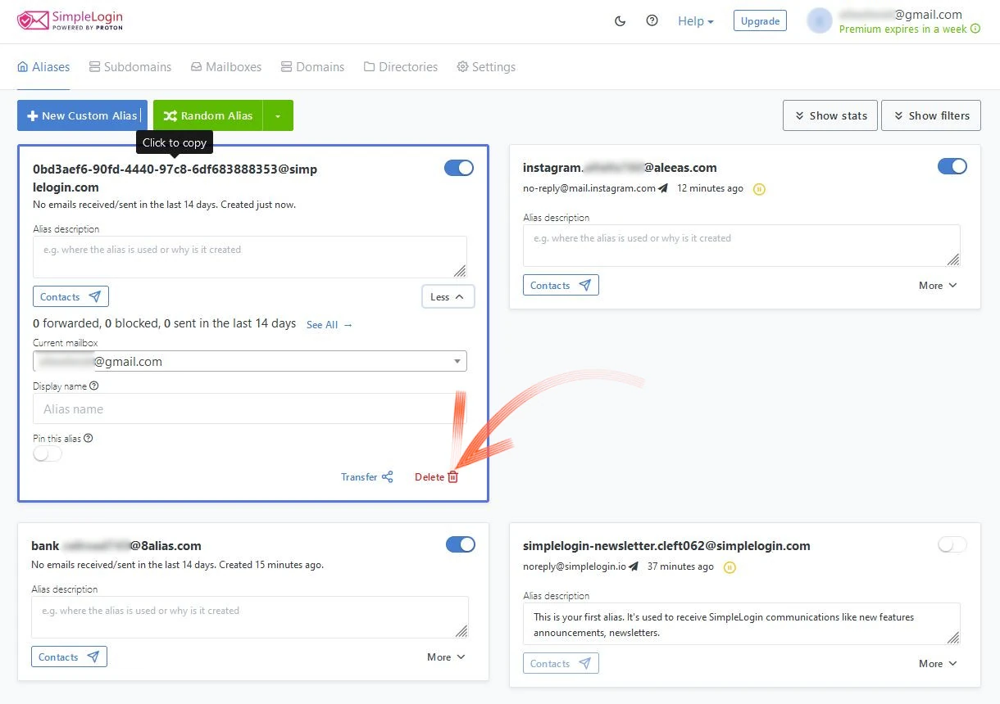

## Gestione degli alias

La creazione degli alias è semplice, così come la loro gestione, che richiede però un po' di accortezza e disciplina.
Tutto il traffico, infatti, passerà comunque attraverso la casella di posta elettronica che abbiamo definito, all'inizio, come quella ufficiale. Notifiche e comunicazioni importanti delle piattaforme continueranno ad arrivare su Gmail, Proton o qualunque sia il provider di posta.

Il risultato, però, è che abbiamo preservato l'indirizzo principale che, dal momento della creazione degli alias, siamo liberi di decidere a chi rivelare e a chi no.

L'alias funziona sia per ricevere che per inviare: un altro utente si vedrà infatti recapitare la risposta da alias.preoccupy789@8shield.net, se questo è lo pseudonimo scelto per quel determinato destinatario.

## Pro

In linea generale, l'uso degli alias aiuta a proteggere l'identità e la privacy. L'indirizzo email viene infatti carpito dai broker di dati e dai siti web visitati, per tracciare abitudini e comportamenti degli utenti. Con l'alias nessuno diventa irrintracciabile, ma il suo utilizzo sistematico è un piccolo passo nella giusta direzione.
Non solo! Nel "villaggio digitale globale", dove hacking, vendita dei dati o violazioni della sicurezza sono all'ordine del giorno, è molto probabile che l'email usata per registrarsi a qualunque sito web, sia già stata oggetto di violazione, se non addirittura presa di mira.

Uno pseudonimo univoco, usato per ogni login, **permette immediatamente di capire quale piattaforma manda nella nostra posta spam (o peggio), perché l'email è identificata dall'alias associato ad essa**. 
Non avete idea di quanto spam e phishing arrivino dai canali cosiddetti affidabili, perché istituzionali, finché non inizierete ad usare un alias per le banche, uno per le poste o uno specifico per alcuni servizi governativi obbligatori.
Una volta identificato il mittente dello spam (o peggio), saprete che quel sito è stato violato, prendendo ogni precauzione per proteggere tutti i dati forniti (pensate alle carte di credito!) a quello specifico sito web, che magari si accorgerà della violazione dopo settimane.

Relativamente a Simple Login, questo strumento ha:

- app per mobile (anche da F-Droid) ed estensione del browser, per gestire gli alias in ogni situazione;
- 2FA per ogni nuovo pseudonimo, per aumentare il grado di indipendenza dal servizio stesso;
- supporto PGP (per gli utenti _Premium)
- creazione semplice di ogni tipo di alias (custom, casuale e UUID);
- tra i piani free del settore, la possibilità di usare gli alias con più caselle email "ufficiali". Altri competitor si limitano ad una sola;

## Contro

- 10 alias potrebbero non essere sufficienti, se si vuole abusare di questo strumento. In questo caso è utile il piano a pagamento, il cui prezzo è abbastanza contenuto, per aumentare il numero a disposizione;
- non è possibile creare un alias con un nome e un dominio preciso. Il suffisso random, aggiunto dopo un nome scelto da noi, genera un alias che definire bizzarro è poco. I social media tradizionali, in genere rifiutano di concedere account creati con questo tipo di indirizzi email. Nostr fixes this!
- se si utilizza un alias per mandare un messaggio a qualcuno, è facile finire nello spam del destinatario. Come prima azione, conviene utilizzare lo pseudonimo per ricevere, proprio come nel caso di creazione di un account, iscrizione a una mailing list ecc.
