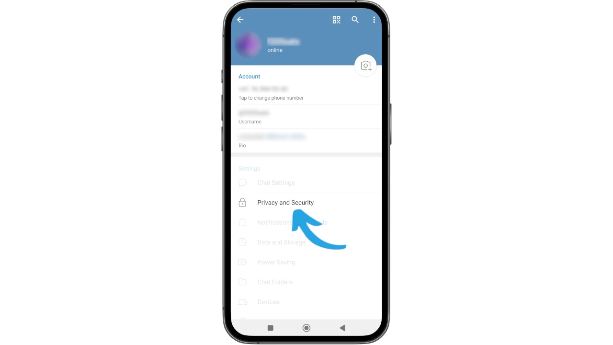
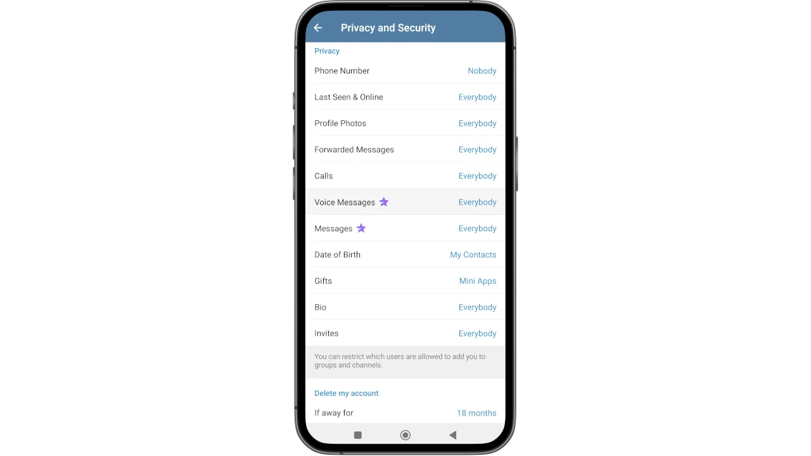
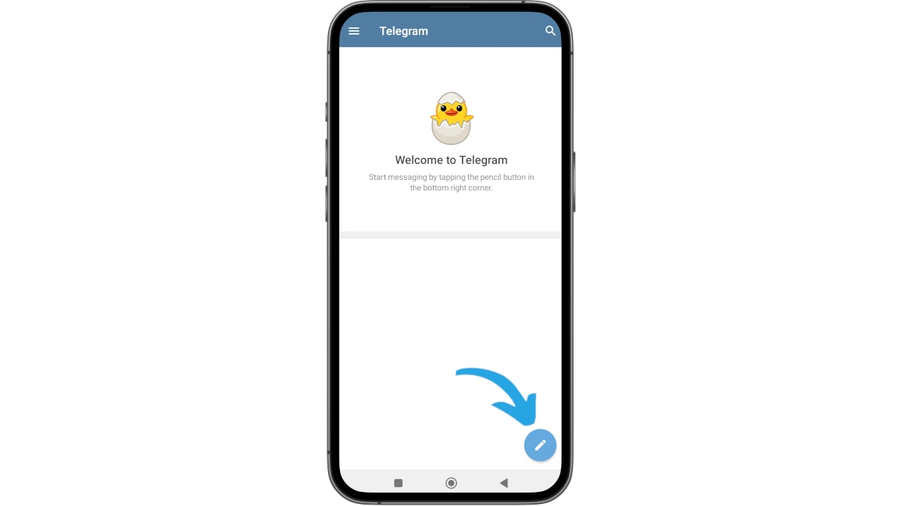
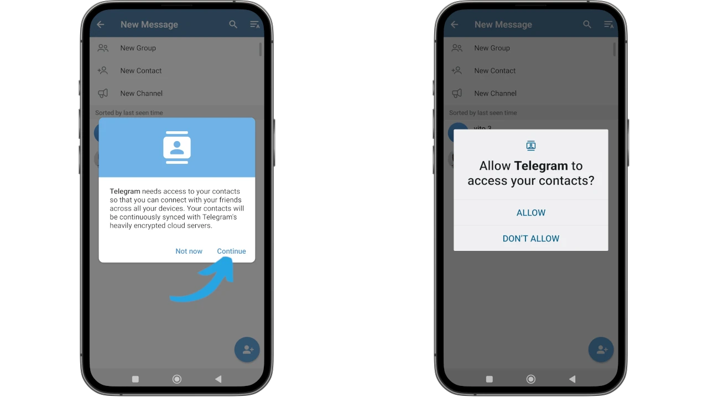
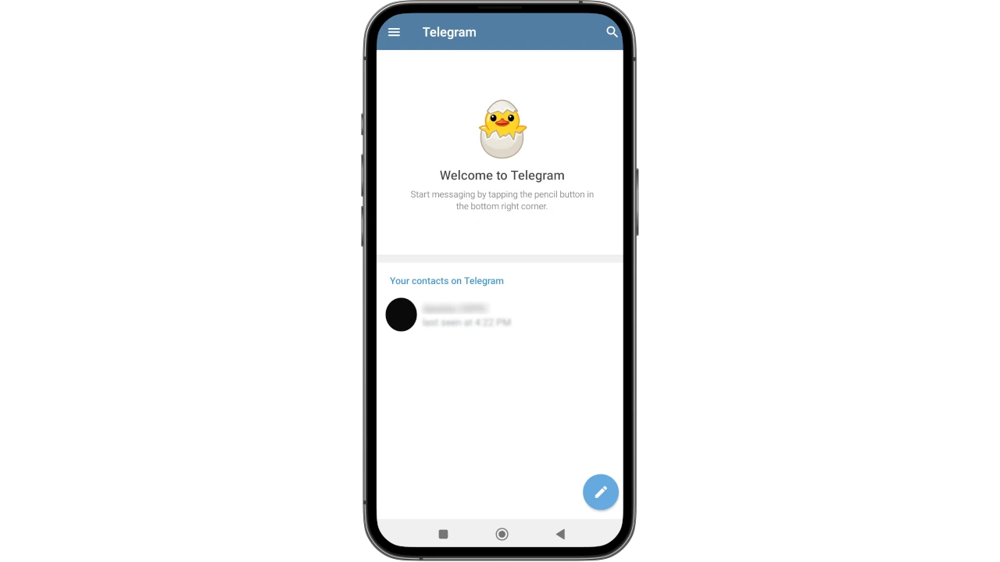
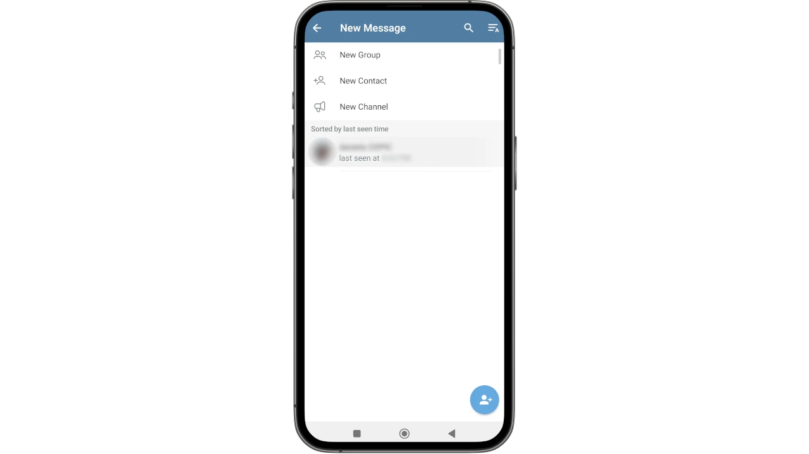
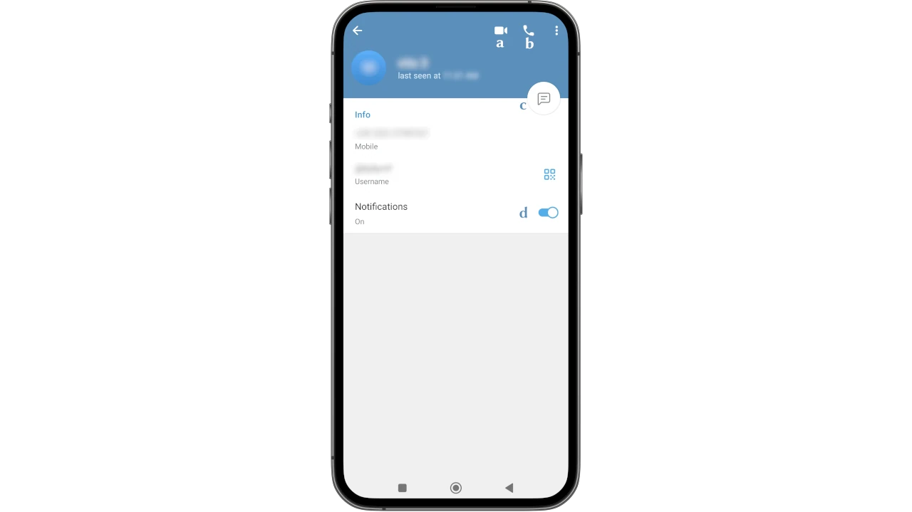
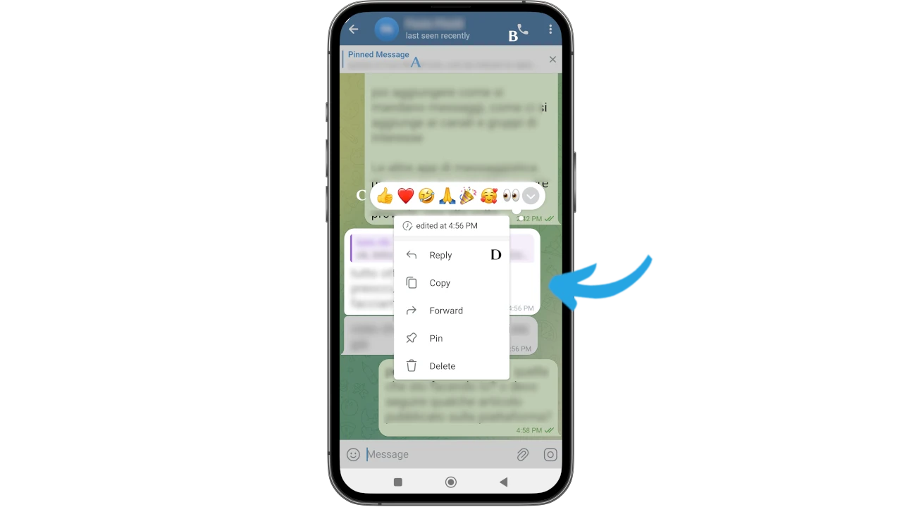
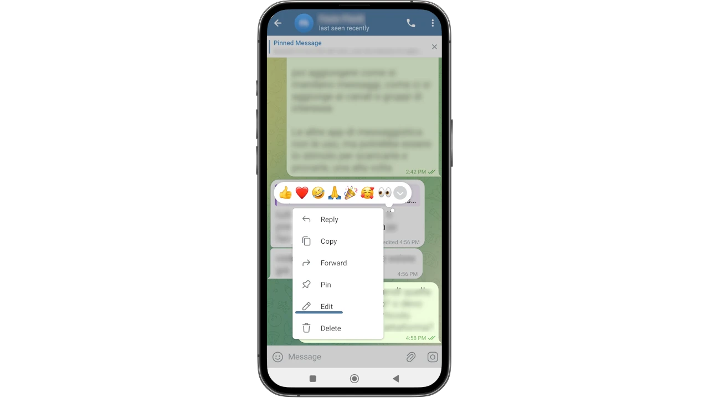
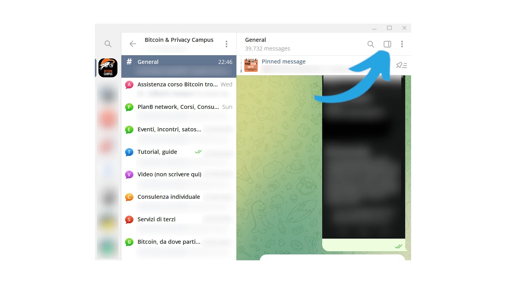

## Perché Telegram
Telegram è ben più di una app di messaggistica e va oltre il concetto di social.
Rispetto a molti suoi competitor ha tante caratteristiche che lo rendono uno strumento da saper usare. 

Oltre a scambiare messaggi, con Telegram puoi effettuare chiamate video e locali, editare o cancellare i messaggi sebbene già inviati, scambiare file pesanti senza limiti di spazio e tanto altro. Speriamo che questo tutorial ti possa aiutare rendendone semplice la conoscenza e, soprattutto, unirti alle numerose community di bitcoiner su Telegram.

## Telegram mobile
Nonostante Telegram sia disponibile sugli store ufficiali, il consiglio è sempre lo stesso: scaricare dal sito dello sviluppatore, una buona abitudine per chi, come te, sta facendo un percorso attento alla privacy.

Con il browser del tuo telefono, vai sul sito [telegram.org](https://telegram.org).
Puoi scegliere la lingua preferita, ma io ti consiglio di proseguire in inglese, quindi scegli _Telegram for Android_

Nella pagina successiva troverai alcuni consigli utili per scaricare il file `.apk`; se non ne hai bisogno clicca direttamente _Download Telegram_.

Il tuo sistema operativo Android stock potrebbe tentare di scoraggiare un download diretto, comunicandoti che il file potrebbe essere dannoso.
Tu scegli _Download anyway_.

Una volta scaricato e installato Telegram, puoi scegliere _Open_ nella schermata finale.

Realizzando questo tutorial ho utilizzato un telefono dove Telegram era già installato. Alla prima installazione, troverai _Install_, anziché _Update_, scegli di installare.

Lascia installare Telegram

dopodiché aprilo dal tuo telefono e scegli _Start Messaging_.

Come ogni buona app di messaggistica VoIP, anche il funzionamento di Telegram si basa su una linea telefonica funzionante.
Per iniziare devi immettere il tuo numero di telefono: Telegram manderà un SMS di verifica con un codice OTP.

Nella schermata successiva puoi ricontrollare il numero che hai comunicato. Se è corretto clicca su _Yes_.

Telegram è ora pienamente funzionante su mobile, possiamo passare alle prime impostazioni di base.

# Impostazioni di sicurezza e privacy

## Configurazione dello username

Lo username di Telegram - a volte denominato anche `handle` - è molto più che un vezzo.
L'handle è infatti **univoco per ogni utente**.
Su Telegram è facile incontrare impostori che scrivono in privato facendo credere di essere chi non sono.
Ogni utente può cascare nel tranello e rivelare informazioni personali credendo di chiacchierare con un contatto di cui ha completa fiducia. **Vedremo che proprio l'handle è la migliore difesa per mitigare questo tipo di pericoli**.

Dal menu principale, scegli _My Profile_.

Nella prossima schermata, seleziona il "pennino" in alto a destra, per entrare nel menu di editing del profilo

Ti compariranno tutti i dettagli sensibili del tuo account Telegram, tra cui il numero di telefono e due campi vuoti: _Bio_  e  _Username_.
**Cliccando su ognuno, puoi compilarli con le tue scelte**.
Configurando lo _Username_, Telegram ti avverte se l'handle è disponibile oppure no.
(Anche in questo caso, lo screenshot è preso da un telefono con lo username già configurato).

Clicca su _Set Username_ (qui _Change Username_ per il motivo appena esposto) 

e configura il tuo handle, poi salva cliccando sul segno ✅ in alto a destra.

Nella maggior parte dei gruppi e canali Telegram, questo username è richiesto come prerequisito per l'accesso. Per gli amministratori di tali gruppi, infatti, è uno dei modi per tenere lontani i bot che porterebbero solo spam.

⚠️ Devi sempre controllare l'handle di chi ti contatta in privato e non dare mai informazioni riservate come password o mnemonic phrase a nessuno, nemmeno se si spaccia per un supporto ufficiale o un aiuto (magari richiesto da te). Blocca gli utenti che ti contattano senza il tuo permesso, perché sicuramente lo fanno a scopo fraudolento.

Come fa un impostore ad assumere l'identità di qualcun altro?
Non può, grazie all'unicità dello username.
**Quello che può fare è mostrare un handle "somigliante", che cambia leggermente (una lettera/numero), in modo che solo ad un occhio attento risulti evidente che si tratta di uno scammer**. Tu presta sempre la massima attenzione allo username e vedrai che gli impostori non avranno gioco facile.

## Privacy

Altra importante precauzione che puoi prendere è limitare le informazioni che fai uscire dal tuo account appena creato.

Torna nel menu principale e poi nei _Settings_:

Ora scegli _Privacy and Security_

Qui troverai tutta una serie di parametri importanti da regolare in base a come vuoi utilizzare il tuo account Telegram.

Abbi cura di impostare:
- _Phone Number_ "Nobody"
- _Calls_ "My Contacts"
-  _Invites_ "Nobody"
  
accorgimenti che ti eviteranno di esporre il tuo numero di telefono, così da non ricevere chiamate indesiderate o venire aggiunto a tua insaputa a gruppi di dubbia provenienza.
In seguito potrai aggiustare tutti gli altri parametri come meglio desideri.
Ora che il tuo account Telegram è impostato e hai guadagnato un minimo di riservatezza, puoi iniziare ad usarlo.

## Aggiungere contatti e chat

Se il tuo account è stato appena creato, è probabile che la pagina principale si presenti completamente vuota.

Qui puoi già vedere le 2 funzioni principali che userai per i messaggi:
- un comando per la ricerca, in alto a destra;
- l'icona con un pennino, in basso a destra, che ti permetterà di aprire la dashboard da cui impostare nuovi messaggi.

Cliccando su quest'ultima, per prima cosa Telegram chiederà il permesso di accedere ai contatti della rubrica, che puoi concedere o meno a seconda della tua esigenza. Approvando, avrai modo da raggiungere i primi amici che già hanno scaricato la app.

Dopodiché i contatti appariranno nella schermata principale.

Cliccando sull'icona con il pennino, in basso a destra, si attiva la schermata per aggiungere altri contatti, ma non solo.
Telegram offre la possibilità di cercare **Gruppi** tematici, che ricordano molto i forum in cui diversi utenti si riuniscono per parlare di un argomento specifico, oppure i **Canali**, solitamente usati come mezzi di informazione dove solo gli amministratori possono postare e i follower fruire dei contenuti.

Selezionando la foto profilo di un contatto presente nella lista, si accede ad un vasto menu per compiere azioni interessanti:
- vedere tutti i dettagli del contatto;
- iniziare una video chiamata (**a**);
- iniziare una chiamata vocale (**b**);
- iniziare una chat (**c**);
- personalizzare le notifiche (**d**).

Si può accedere ad un menu molto avanzato, cliccando sui 3 pallini in alto a destra, per:
- impostare un timer per l'auto cancellazione dei messaggi;
- condividere, bloccare o editare il contatto;
- mandare un regalo (Telegram Premium);
- iniziare una chat segreta, che è una delle caratteristiche più carine di Telegram: **una chat segreta è uno spazio dove, ad esempio, non è possibile fare screenshot, è una chat molto riservata ed è attiva solo da cellulare**;
- aggiungere il contatto sulla home screen.

Di default tutti, dai singoli utenti ai canali tematici, sono identificati dall'handle. Quando si ricerca qualcuno o qualcosa, è sufficiente mettere la chiocciolina `@` seguita da un nome.

⚠️Attenzione: evita di unirti a gruppi e canali senza verificarne l'autenticità. Per trovare il canale/gruppo Telegram ufficiale di un'azienda o tematica che desideri seguire, fatti aiutare dalla sezione _Contatti_ dei siti ufficiali o da fonti altamente affidabili.

### Funzioni avanzate per i messaggi

Telegram ti permette di usare funzioni avanzate uniche, quando si tratta di scambiare messaggi.
Entra in una chat e clicca sullo sfondo, a fianco di uno qualunque dei messaggi di un altro mittente.

Compaiono una serie di opzioni con cui puoi:
- appuntare i messaggi (_pin_ **A**) per una ricerca rapida di quelli importanti;
- iniziare una chiamata (**B**);
- inserire reactions (**C**);
- inoltrare, copiare, cancellare il messaggio (**D**);
- selezionare più di un messaggio per azioni multiple.

Se fai la stessa operazione su uno dei tuoi messaggi, invece, **scoprirai che puoi editare i tuoi stessi messaggi, anche quelli già inviati**.

Puoi inoltre allegare file di grandi dimensioni, scambiando media "pesanti" agevolmente, molto più di tutte le altre app di questo tipo.

### Cloud personale

Tra le tante e incredibili caratteristiche di Telegram, c'è anche un cloud personale che - al momento in cui scriviamo - è **illimitato**.

Sto parlando dei famosi "Messaggi Salvati", o _Saved Messages_ di Telegram.
È una chat in cui puoi inviarti quasi (1) qualunque tipo di informazione, per esempio passare dei file da PC a mobile e viceversa.

Per accedere ai _Messaggi Salvati_ del tuo account, vai nel menu principale e seleziona la relativa voce tra le opzioni che compaiono nella schermata.

La chat compare in primo piano, pronta per essere utilizzata.

***
(1) _Non usare il cloud di Telegram per informazioni riservate quali password, pin, mnemoniche e dati di questo genere_.

## Schedulare i messaggi o invio silenzioso

Altre utili funzionalità avanzate permettono di inviare messaggi rispettando la privacy dei destinatari, scegliendo tra l'invio in modalità silenziosa, piuttosto che posticipare l'arrivo del messaggio in orario e giorno consoni.

Tutto ciò che devi fare è scrivere il messaggio ma, anziché inviarlo subito, tieni premuta l'icona dell'invio per qualche secondo. Quello che di solito diventa un messaggio inviato, lascia il posto ad una nuova schermata in cui potrai scegliere tra:
- schedulare il messaggio (data e ora)
- mandare solo quando il contatto è online
- inviare silenziosamente, per non attivare le notifiche del destinatario.

### Liberare la cache del tuo telefono

Un'altra utile pratica, per tenere efficiente il tuo telefono, è quella di liberare la cache di Telegram, di tanto in tanto.
A seconda di quanti gruppi e canali segui, infatti, le informazioni e i media in arrivo da queste fonti potrebbero accumularsi nella cache, rendendo il tuo telefono lento.

Entra di nuovo nei menu principali, cliccando le tre barrette in alto a destra e scegli di nuovo _My Profile_. Stavolta, però, seleziona i 3 pallini in altro a destra.

Si apre un menu a tendina dal quale devi selezionare _Log Out_.

⚠️ **Non devi fare logout, quindi presta attenzione: scegliamo questo menu solo per accedere alla funzionalità di pulizia della cache**.

Tra le opzioni, scegli appunto _Clear Cache_.

Il dispositivo inizia a quantificare mega/giga di memoria cache utilizzata. Quando ha finito, compare il tasto _Clear Cache_.

Cliccandolo compare una schermata di conferma, su cui bisogna scegliere di nuovo _Clear Cache_ per procedere.

Terminato il processo, Telegram mostra una schermata dove - sotto l'esito della pulizia cache - compare anche un interessante impostazione, che permette di scegliere quanto spazio di memoria deve essere dedicato a questa cache.
Ti consiglio di non tenere uno spazio illimitato per foto e video, ma di permettere alla app di rimuovere i file pesanti una volta raggiunto questo limite.
Puoi vedere nella foto che segue dove trovare questa impostazione.

## Telegram desktop

Telegram si può utilizzare dal tuo computer, in modo che sia sincronizzato con l'account visualizzato dal telefono. Puoi scegliere di non scaricare l'applicazione e di usarlo solo via web. Tale versione, tuttavia, ha delle limitazioni rispetto a quella eseguita sul computer, pertanto ti consiglio di fare download ed installazione per sfruttare al meglio questo potente strumento.
Tutte le opzioni viste fin qui con il modello mobile, si possono sfruttare nello stesso identico modo dal tuo computer.
Anche per questa installazione vai sul sito ufficiale [telegram.org](https://telegram.org). Dalla homepage scegli _Telegram for PC/Linux_.

Nella schermata che si apre clicca per scaricare l'eseguibile adatto al tuo sistema operativo.

Installa Telegram e lancialo, in modo da trovare subito la prima schermata dove cliccherai _Start Messaging_.

Telegram mostra sullo schermo un QR Code, da inquadrare con il tuo dispositivo mobile, quello su cui è già attivo il tuo account. È così che potrai usare quell'account via desktop.

Apri Telegram sul cellulare, vai nel menu principale (le tre barrette in alto a sinistra).

Seleziona _Settings_

e subito dopo _Devices_.

Seleziona ora _Link Desktop Device_

Si attiva la fotocamera del tuo telefono. Al primo utilizzo è probabile che il tuo Android chiederà i permessi: concedili.

Ora inquadra il QR Code comparso prima sullo schermo del computer

Un avviso sul tuo telefono è la conferma che il nuovo dispositivo è stato aggiunto correttamente.

Soprattutto Telegram è attivo ed utilizzabile anche sul tuo desktop.

### Call di gruppo

Se sei amministratore o owner di un gruppo Telegram, puoi avviare una call dai menu del gruppo stesso. Potrai così fare delle dirette streaming con più partecipanti, registrarle in audio e video, condividerle o utilizzarle per scopi ad esempio didattici.

Nell'immagine seguente puoi vedere come far partire una call di gruppo usando Telegram desktop: vai nella chat dello stesso e nella schermata a destra è presente l'icona di uno schermo. Cliccando su quella potrai decidere se far partire la chiamata immediatamente, oppure schedularla per un orario prestabilito.

